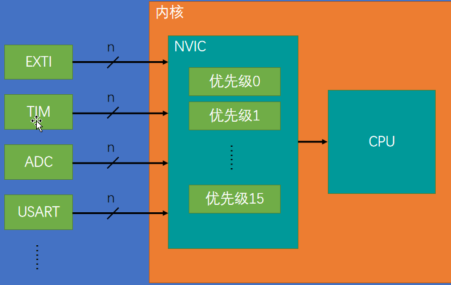
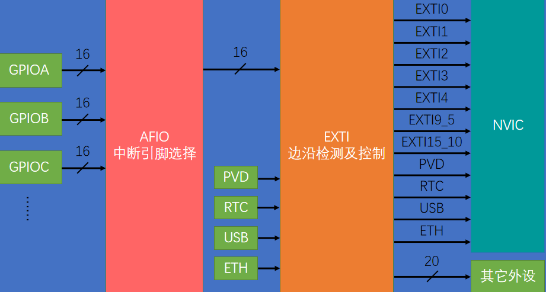

## 外部中断

STM32中，支持68个可屏蔽中断通道，包括如下：

| 名称                 | 说明             |
| -------------------- | ---------------- |
| WWDG                 | 窗口看门狗中断   |
| PVD                  | 电源电压检测中断 |
| EXTI 0-4、5_9、10_15 | 外部中断         |
| DMA1CH1-7            | DMA1通道1~7中断  |
| TIM                  | TIM相关中断      |
| USART                | 串口相关中断     |
| IIC                  | IIC相关          |
| ......等             |                  |

中断的发生是在外部，在CPU接收中断之前，存在NVIC对各个中断进行优先级仲裁



本节考虑仅考虑，EXTI0...EXTI4、EXTI9_5、EXTI15_10。-



注：Pin号相同的引脚（如GPIOA_Pin0、GPIOB_Pin0、GPIOC_Pin0）连接的是同一个外部中断线。

流程：

-   1、开启引脚、AFIO时钟
-   2、初始化引脚
-   3、选择中断线，一般Pin几就选几
-   4、EXTI初始化
-   5、NVIC配置
-   6、中断处理函数

代码示例：GPIOB_Pin14引脚为例

```c

/*开启时钟*/
RCC_APB2PeriphClockCmd(RCC_APB2Periph_GPIOB, ENABLE);		//开启GPIOB的时钟
RCC_APB2PeriphClockCmd(RCC_APB2Periph_AFIO, ENABLE);		//开启AFIO的时钟，外部中断必须开启AFIO的时钟

/*GPIO初始化*/
GPIO_InitTypeDef GPIO_InitStructure;
GPIO_InitStructure.GPIO_Mode = GPIO_Mode_IPU;
GPIO_InitStructure.GPIO_Pin = GPIO_Pin_14;
GPIO_InitStructure.GPIO_Speed = GPIO_Speed_50MHz;
GPIO_Init(GPIOB, &GPIO_InitStructure);						//将PB14引脚初始化为上拉输入

/*AFIO选择中断引脚*/
GPIO_EXTILineConfig(GPIO_PortSourceGPIOB, GPIO_PinSource14);//将外部中断的14号线映射到GPIOB，即选择PB14为外部中断引脚

/*EXTI初始化*/
EXTI_InitTypeDef EXTI_InitStructure;						//定义结构体变量
EXTI_InitStructure.EXTI_Line = EXTI_Line14;					//选择配置外部中断的14号线
EXTI_InitStructure.EXTI_LineCmd = ENABLE;					//指定外部中断线使能
EXTI_InitStructure.EXTI_Mode = EXTI_Mode_Interrupt;			//指定外部中断线为中断模式
EXTI_InitStructure.EXTI_Trigger = EXTI_Trigger_Falling;		//指定外部中断线为下降沿触发
EXTI_Init(&EXTI_InitStructure);								//将结构体变量交给EXTI_Init，配置EXTI外设

/*NVIC配置*/
NVIC_InitTypeDef NVIC_InitStructure;						//定义结构体变量
NVIC_InitStructure.NVIC_IRQChannel = EXTI15_10_IRQn;		//选择配置NVIC的EXTI15_10线
NVIC_InitStructure.NVIC_IRQChannelCmd = ENABLE;				//指定NVIC线路使能
NVIC_InitStructure.NVIC_IRQChannelPreemptionPriority = 1;	//指定NVIC线路的抢占优先级为1
NVIC_InitStructure.NVIC_IRQChannelSubPriority = 1;			//指定NVIC线路的响应优先级为1
NVIC_Init(&NVIC_InitStructure);								//将结构体变量交给NVIC_Init，配置NVIC外设
```

注意，要使用中断，就要**配置中断分组**，程序只需要配置一次中断分组，一般放在程序运行开始。

```c
/*NVIC中断分组*/
NVIC_PriorityGroupConfig(NVIC_PriorityGroup_2);				
//配置NVIC为分组2
//即抢占优先级范围：0~3，响应优先级范围：0~3
//此分组配置在整个工程中仅需调用一次
//若有多个中断，可以把此代码放在main函数内，while循环之前
//若调用多次配置分组的代码，则后执行的配置会覆盖先执行的配置
```

**中断服务函数**，函数在启动文件中：`startup_stm32f10x_md.s`已声明好了。因为此程序使用的是`EXTI15_10_IRQn`线路，故中断服务函数名为：`EXTI15_10_IRQHandler`

```C
void EXTI15_10_IRQHandler(void)
{
	if (EXTI_GetITStatus(EXTI_Line14) == SET)		//判断是否是外部中断14号线触发的中断
	{
		//TODO
		EXTI_ClearITPendingBit(EXTI_Line14);		//清除外部中断14号线的中断标志位
													//中断标志位必须清除
													//否则中断将连续不断地触发，导致主程序卡死
	}
}
```

