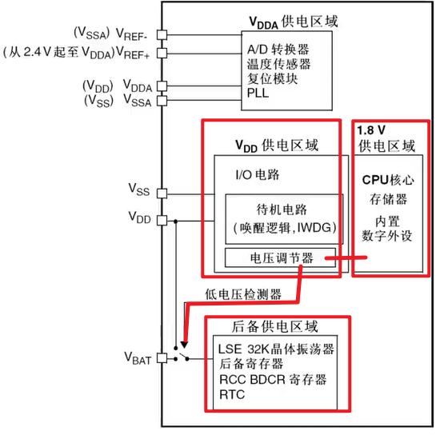
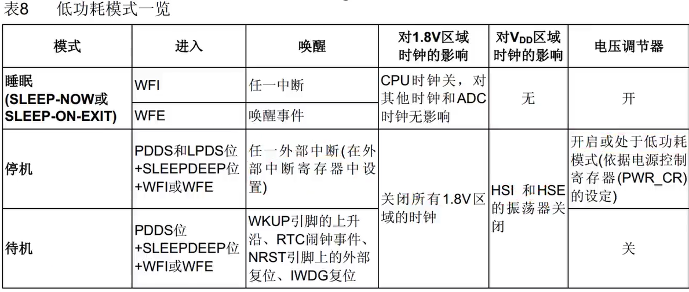
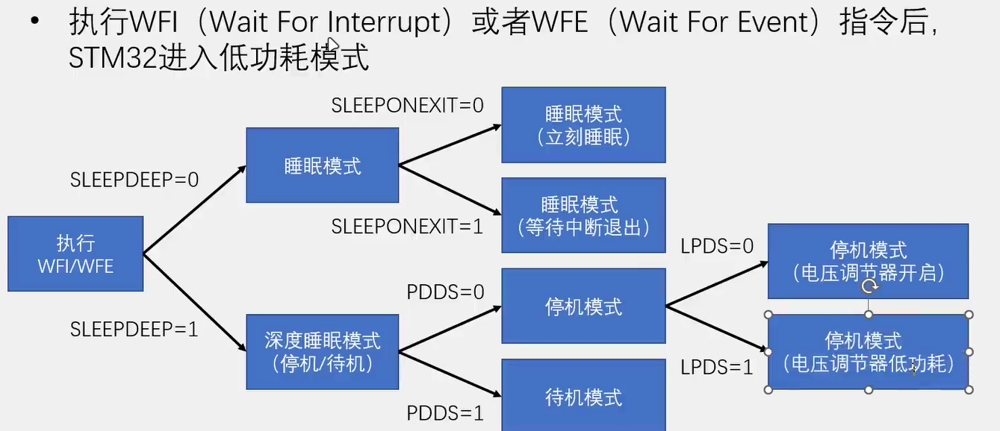

## PWR电源控制

1.  PWR负责管理stm32内部的电源供电部分，可实现可编程电压检测器和低功耗模式功能
2.  可编程电压检测器PVD可以监控VDD电源电压，可触发中断
3.  低功耗模式：睡眠模式，停机模式，待机模式



STM32的工作电压VDD是3.3V，经过电解后变为1.8V为内部核心芯片供电，当主电源VDD 掉电后，通过VBAT 脚（电池）为实时时钟(RTC)和备份寄存器提供电源。VDDA为模拟供电区域，让ADC等独立供电。



模式选择

-   **睡眠模式**：直接设置WFI或者WFE，进入睡眠模式，程序停止，任意中断或时间可唤醒，唤醒后从暂停位置运行，因为内部核心还有电，SRAM和寄存器保持数据不丢失。
-   **停机模式**：1.8V供电区时钟停止，PLL、HSI、HSE被禁止，SRAM和寄存器数据可保持。唤醒后从暂停位置运行，但会默认选择LSI时钟（8MHz），因此需要重新启用PLL和HSE，使其恢复72MHz。
-   **待机模式**：唤醒后从头运行。1.8V区被断电，PLL、HSI、HSE段带你，SRAM和寄存器数据丢失。只有备份寄存器和待机电路维持供电，待机模式下，所有IO引脚为高阻态（浮空输入）

## RCC时钟：`system_stm32f10x.c\system_stm32f10x.c`


```c
__WFI()；

__WFE()；

    
void PWR_DeInit(void);
//使能后背区域的访问，RTC、BKP
void PWR_BackupAccessCmd(FunctionalState NewState);
//PVD使能
void PWR_PVDCmd(FunctionalState NewState);
//PVD阈值电压配置
void PWR_PVDLevelConfig(uint32_t PWR_PVDLevel);
//使能WakeUP引脚唤醒功能
void PWR_WakeUpPinCmd(FunctionalState NewState);
//停止模式
void PWR_EnterSTOPMode(uint32_t PWR_Regulator, uint8_t PWR_STOPEntry);
//待机模式
void PWR_EnterSTANDBYMode(void);

FlagStatus PWR_GetFlagStatus(uint32_t PWR_FLAG);

void PWR_ClearFlag(uint32_t PWR_FLAG);
```

