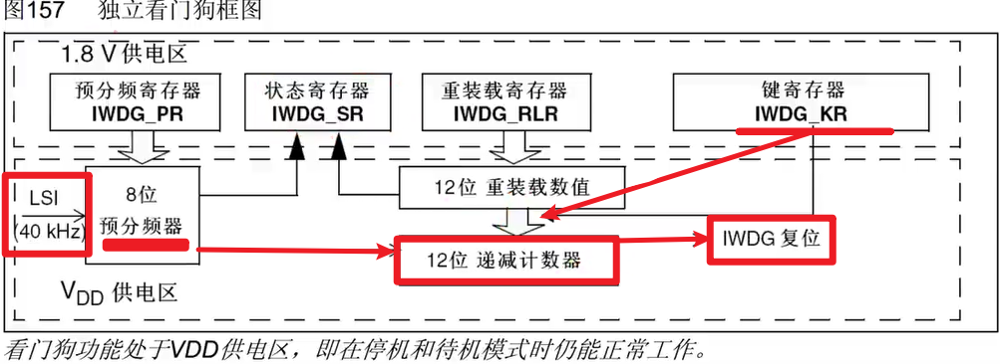
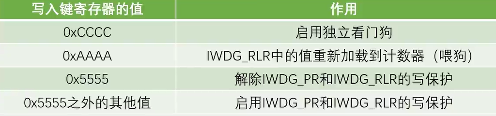
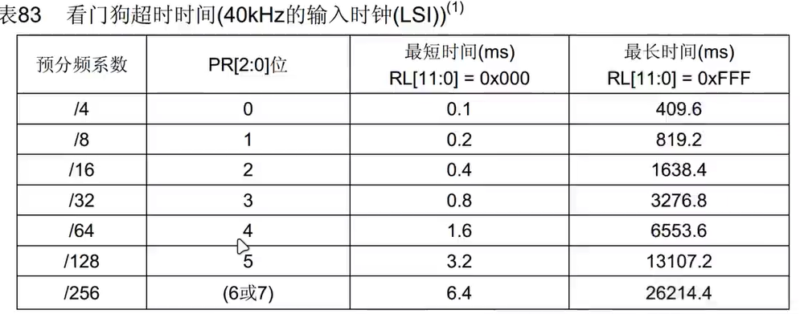
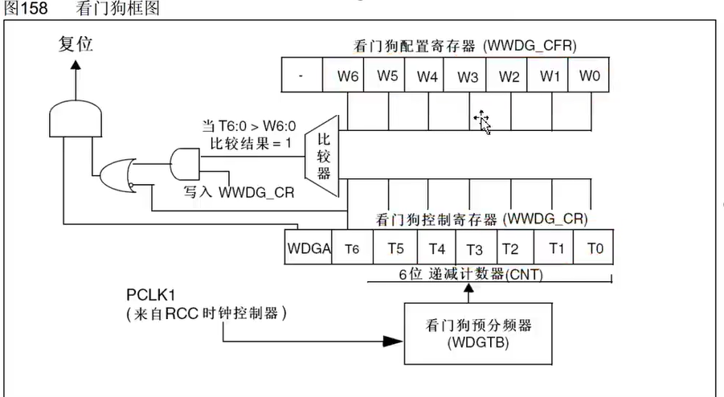
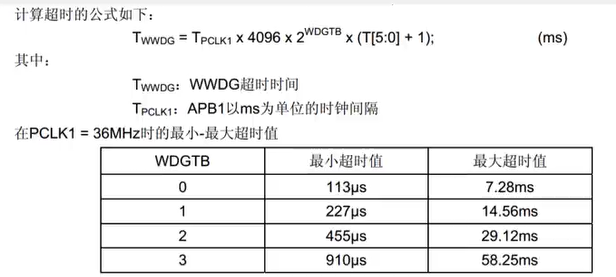
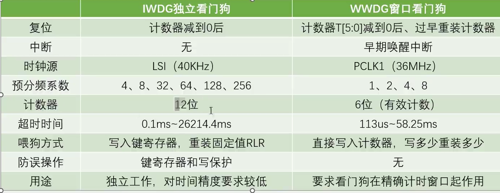

## WDG

设置一个喂狗时间，如果不在指定时间内及时喂狗，就会触发看门狗复位电路，程序会复位。这么做是为了方式程序在运行时陷入莫名其妙的BUG和循环，而导致程序卡死、崩溃。本质就是一个**定时器**。定时器中的计数器溢出，产生复位信号。喂狗也就是重置计数器，计数器自减运行。


### IWDG：独立看门狗

独立运行（LSI时钟），对时间要求低，不超过喂狗时间就好。



键寄存器，用来控制看门狗





```c
/*IWDG初始化*/
IWDG_WriteAccessCmd(IWDG_WriteAccess_Enable);	//独立看门狗写使能，解除保护
//LSI = 40K，
/*

超时时间公式：Ti = Tlsi X PR预分频系数 X (RL + 1)
想设置超时时间1000ms，查表的PR需要设置为16分频     IWDG_SetPrescaler(IWDG_Prescaler_16);
Tlsi = 1/40 单位是ms
故得出PL = 2499     IWDG_SetReload(2500 - 1)

*/
IWDG_SetPrescaler(IWDG_Prescaler_16);			//设置预分频为16
IWDG_SetReload(2500 - 1);							//设置重装值为2499，独立看门狗的超时时间为1000ms
IWDG_ReloadCounter();							//重装计数器，喂狗
IWDG_Enable();									//独立看门狗使能
```

#### WWDG：窗口看门狗

使用APB1的时钟。喂狗时间不能再上下阈值之外





```C
/*开启时钟*/
	RCC_APB1PeriphClockCmd(RCC_APB1Periph_WWDG, ENABLE);	//开启WWDG的时钟
	
	/*WWDG初始化*/
	//APB1 36MHz  
	/*
	想设置超时时间50ms，看表得出WDGTB=3    WWDG_SetPrescaler(WWDG_Prescaler_8);
	
	超时时间公式：Tw = Tplck1 X 4096 X 2^WDGTB X (T[5:0] + 1)
	Tw:50ms
	Tplck1:1/36k(这里以毫秒为单位)
	WDGTB:3
	得出T[5:0] = 54     WWDG_Enable(0x40 | 54);
	
	窗口超时公式：Tw = Tplck1 X 4096 X 2^WDGTB X (T[5:0] -W[5:0])
	想设置窗口时间30ms
	得出W[5:0] = 21     WWDG_SetWindowValue(0x40 | 21);
	*/
	WWDG_SetPrescaler(WWDG_Prescaler_8);			//设置预分频为8
	WWDG_SetWindowValue(0x40 | 21);					//设置窗口值，窗口时间为30ms
	WWDG_Enable(0x40 | 54);							//使能并第一次喂狗，超时时间为50ms
```


### 两者的区别

