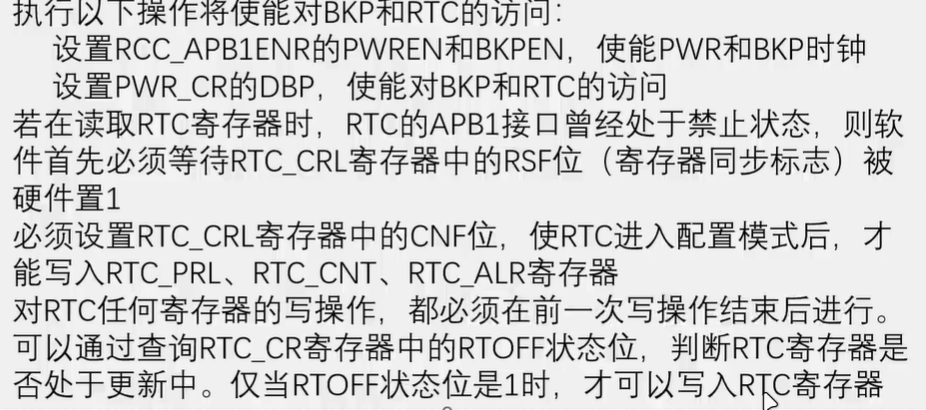
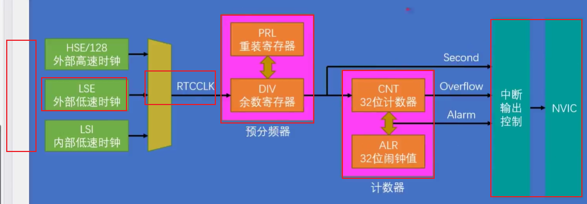
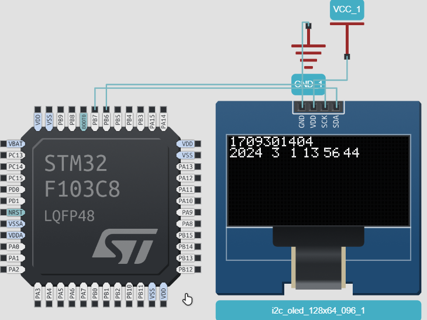

## BKP

时钟初始化

`RCC_APB1Periph_PWR`和`RCC_APB1Periph_BKP`需要一起开

`PWR_BackupAccessCmd`使能或者失能PWR和BKP

## RTC

-   时钟配置和RTC功能使能
-   启动LSE（默认关闭）`RCC-LSEConfig`
-   设置RTCCLK选择LSE `RCC_RTCCLKConfig、RCC_RTCCLKCmd`
-   等待APB总线和RTC时钟同步、等待上一次RTC操作完成
-   设置与分频器使其输出1Hz
-   (每次操作完RTC后都要等上次操作完成)
-   读CNT计数器
-   可选：设置闹钟
-   可选：设置中断

