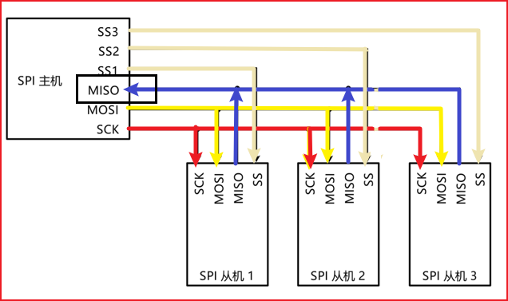
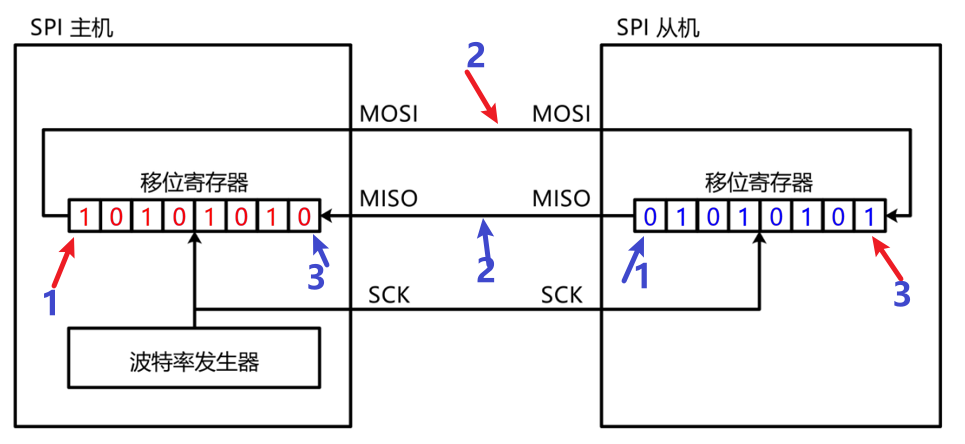
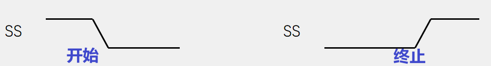
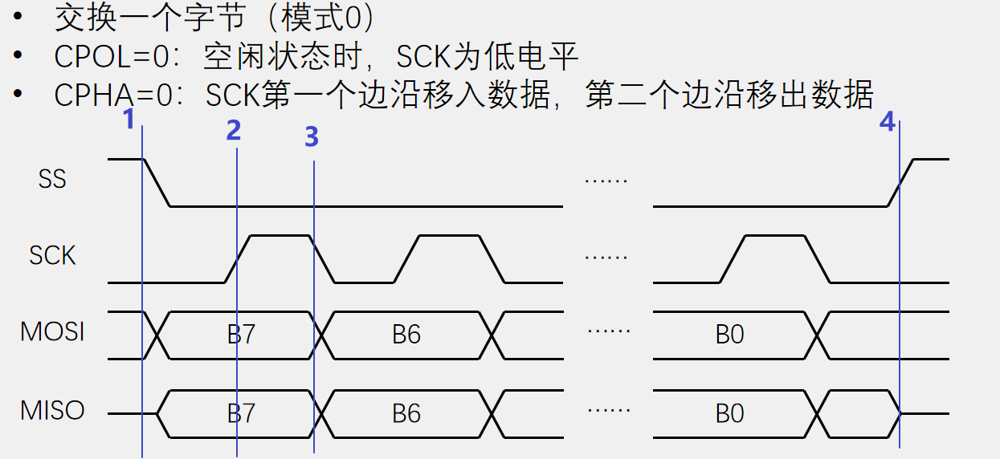
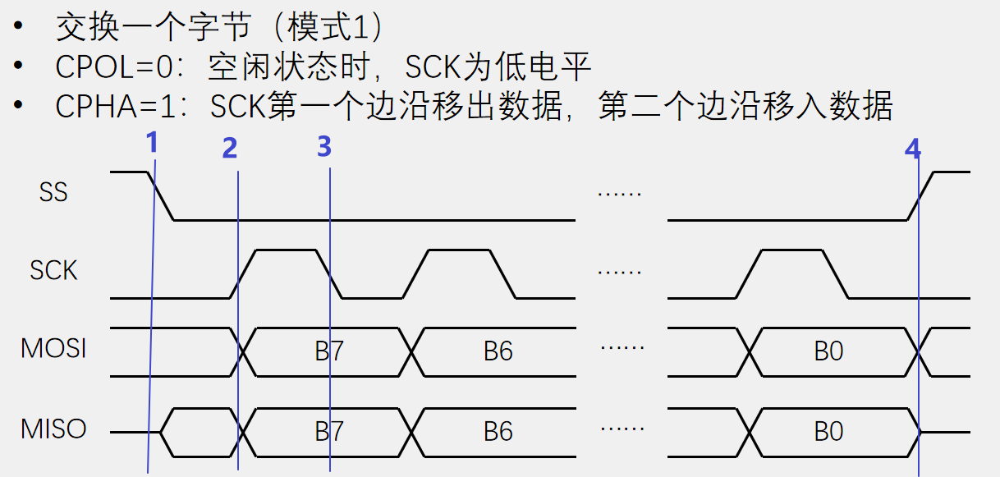
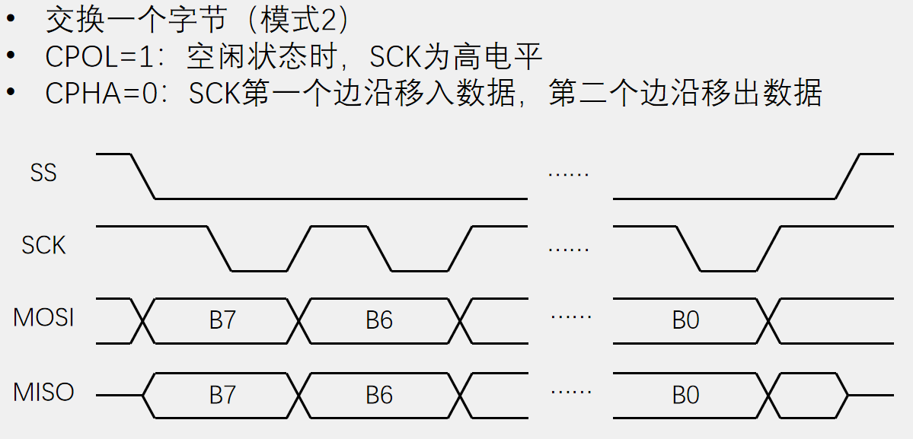
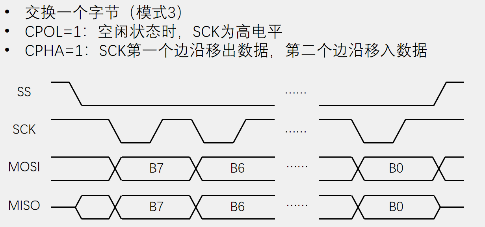

# SPI

## 概念

-   SPI有四根通信线SCK：时钟线，MISO：主机输入从机输出，MOSI：主机输出从机输入，SS：从机选择线（每个从机一根）。
-   SPI支持同步全双工，一主多从模式。
-   输出引脚：推挽输出，输入引脚浮空/上拉输入

## 移位单元

下图是SPI的移位单元，过程是：在SCK上升沿，1处的数据移动到2处，然后在SCK下降沿，移动到3处，完成移位，连续8个循环，就完成了1byte的数据交换。

## 时序

### 开始与终止

SS下降沿，表示开始，上升沿，表示终止

### 传输数据

**在模式0下**，CPOL=0，CPHA=0，在1处（ss下降沿，开始信号）时，就确定MOSI与MISO的电平，在2处（SCK上升沿）传输，然后在3处（SCK下降沿）放数据，，，，，，最后SS拉高结束传输。

**在模式1下**，CPOL=0，CPHA=1，数据在2处（SCK上升沿）放入，在3处（SCK下降沿）传输，，，

**模式2和模式3如下**

