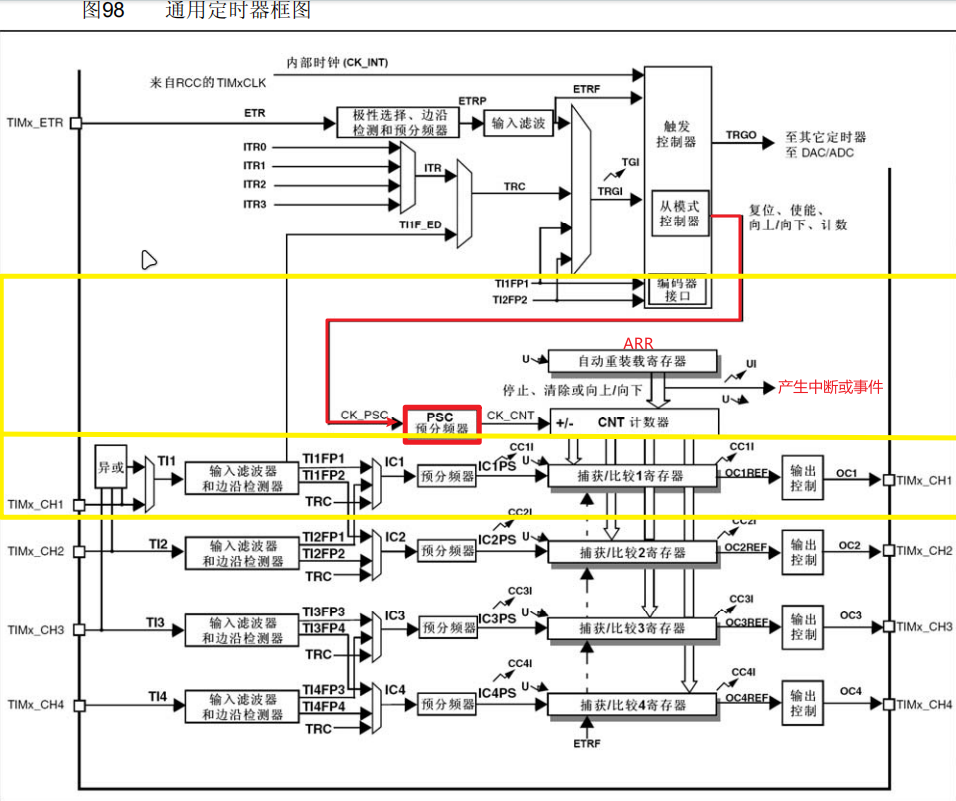

## 定时器中断

定一个时，时间到了产生一次中断。



TIMx挂载在APB2上，这里选择内部时钟72MHz。经过PSC分频后得到驱动CNT的频率。以向上计数为例，CNT从0开始以PSC后的频率开始自增计数，当CNT==ARR时，触发中断或者中断事件（右边）。

*如果在下面加入捕获比较电路，就可以输出PWM。*


**流程：**

1.  开启定时器时钟
2.  选择内部时钟源
3.  配置时钟计数器
4.  使能时钟
5.  配置NVIC
6.  定时器中断函数编写

``` c
//开启定时器时钟
RCC_APB1PeriphClockCmd(RCC_APB1Periph_TIM2,ENABLE);
//为TIM2选择内部时钟，缺省
TIM_InternalClockConfig(TIM2);
//初始化
TIM_TimeBaseInitTypeDef TIM_TimeBaseInitStruct;
TIM_TimeBaseInitStruct.TIM_ClockDivision = TIM_CKD_DIV1;
TIM_TimeBaseInitStruct.TIM_CounterMode = TIM_CounterMode_Up;
TIM_TimeBaseInitStruct.TIM_Period = 10000 - 1;//10k/10000 = 1s
TIM_TimeBaseInitStruct.TIM_Prescaler = 7200 - 1;//72m/7200 = 10k
TIM_TimeBaseInitStruct.TIM_RepetitionCounter = 0;//只有高级定时器有这个
TIM_TimeBaseInit(TIM2,&TIM_TimeBaseInitStruct);

/*中断输出配置*/
TIM_ClearFlag(TIM2, TIM_FLAG_Update);						//清除定时器更新标志位
//TIM_TimeBaseInit函数末尾，手动产生了更新事件
//若不清除此标志位，则开启中断后，会立刻进入一次中断
//如果不介意此问题，则不清除此标志位也可

TIM_ITConfig(TIM2, TIM_IT_Update, ENABLE);					//开启TIM2的更新中断
  /*
  *    This parameter can be any combination of the following values:
  *     @arg TIM_IT_Update: TIM update Interrupt source
  *     @arg TIM_IT_CC1: TIM Capture Compare 1 Interrupt source
  *     @arg TIM_IT_CC2: TIM Capture Compare 2 Interrupt source
  *     @arg TIM_IT_CC3: TIM Capture Compare 3 Interrupt source
  *     @arg TIM_IT_CC4: TIM Capture Compare 4 Interrupt source
  *     @arg TIM_IT_COM: TIM Commutation Interrupt source
  *     @arg TIM_IT_Trigger: TIM Trigger Interrupt source
  *     @arg TIM_IT_Break: TIM Break Interrupt source
  */

//需要开启使能才能工作
TIM_Cmd(TIM2,ENABLE);
```
1.  `TIM_Prescaler`这是定时器的预分频值。它用来减慢定时器的时钟频率，从而使定时器的计数速度变慢。这里设置成7200，本来stm32f10x是72MHz，就是一秒跳变72M次，通过分频使其在10k完成。
2.  `TIM_Period`这是定时器的周期值。它决定了定时器溢出（从计数器值归零）的时间间隔。预分频后10k次计数是1s，这里令其技术到（10000-1），正好是1s。

**配置NVIC**

```C
//定时器中断也是中断，故需要配置NVIC

//NVIC_PriorityGroupConfig(NVIC_PriorityGroup_2);
    //NVIC_Init
NVIC_InitTypeDef NVIC_InitStruct;
NVIC_InitStruct.NVIC_IRQChannel = TIM2_IRQn;
NVIC_InitStruct.NVIC_IRQChannelCmd = ENABLE;
NVIC_InitStruct.NVIC_IRQChannelPreemptionPriority = 2;
NVIC_InitStruct.NVIC_IRQChannelSubPriority = 1;
NVIC_Init(&NVIC_InitStruct);
```

**中断服务函数**

```c
void TIM2_IRQHandler()
{
	if(TIM_GetFlagStatus(TIM2,TIM_FLAG_Update)==SET)
	{
		//TODO
		TIM_ClearITPendingBit(TIM2,TIM_FLAG_Update);
	}
}
```
