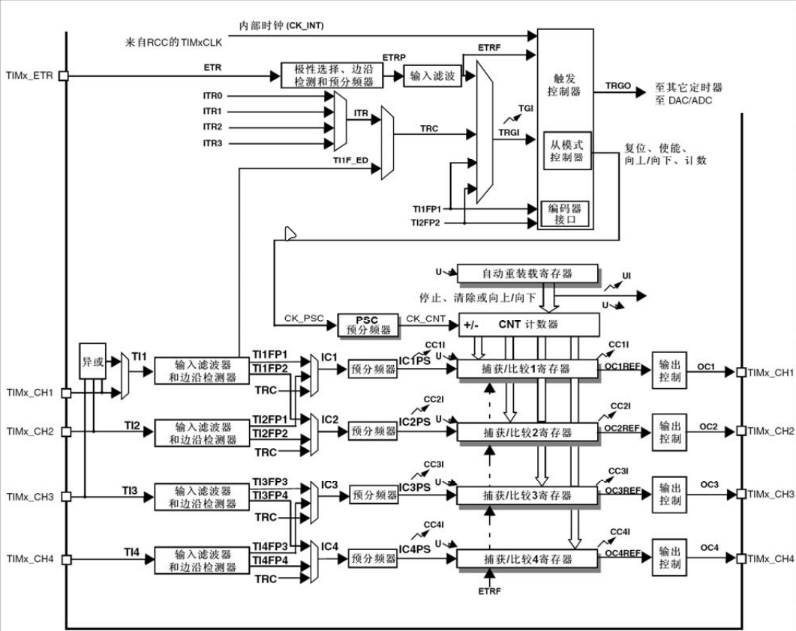

利用PWM实现LED呼吸灯的效果

PA2--LED--TIM2CH3

PWM实现舵机控制，每按一次按键，角度+45

定时器的定时时间  timeout=（period+1）*（Prescaler+1）/timeclockfren  

这里的timeout单位是us，该单片机时钟为72mhz，故timeclockfren为72

Period就是计数周期的值，CNT寄存器计数到该值后，产生中断。

单片机为72Mhz，首先设置与分频值Prescaler为（72-1），这样可以获得1Mhz的频率，然后对其计数，设置period置为（20000-1），这样就是计数20000次，1mhz的意思是1秒内单片机震荡1m次，那么震荡（计数）20000次就是20ms，故可以得到20ms的时钟周期。

时基单元中有三个寄存器

1.  预分频寄存器 PSC --->Prescaler
2.  计数器 CNT  不断增加和ARR比较
3.  自动重装载寄存器 ARR --->Period

