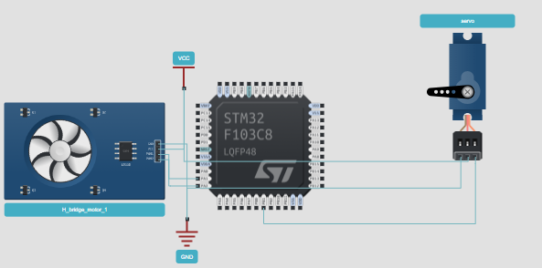

## 输出比较OC ##

输出比较通过设置CNT与CCR寄存器的值的关系，来对输出电平进行置1、置0和翻转操作。用于输出一定频率占空比的PWM波形。CCR寄存器是输入捕获和输出比较共用的。

输出比较的四个模式：

-   冻结：CNT==CCR时，输出不变
-   匹配时有效：CNT==CCR时，输出有效电平
-   匹配时无效：CNT==CCR时，输出无效电平
-   匹配时翻转：CNT==CCR时，翻转输出电平
-   **PWM1：向上计数时，：CNT<CCR，输出有效电平,CNT>=CCR,无效电平**（掌握这一种就能输出PWM）
-   PWM2：向上计数时，：CNT<CCR，输出无效电平,CNT>=CCR,有效电平。


ERF就是再经过**极性选择，选择为高，则原样输出**；选择为底，则翻转输出。

PWM就是方形波，一会输出高电平一会输出低电平。这里的电平翻转的时机就靠CNT和CCR比较而来，假设在PWM1模式下，向上计数。如上图A所示，CCR为30,99为ARR，CNT向上自增，在CNT小于CCR的时候，输出高电平，当CNT大于CCR（30）的时候，就输出低电平，自增到ARR时，变为0，重新开始自增。此为一个周期。输出的波形就是上图B的波形图。

**通过调整CCR的大小，就能调整PWM波形。**

**流程：**

1.  GPIO初始化（服用推挽输出）
2.  定时器时基单元初始化（计算好PSC和ARR）
3.  输出比较单元初始化
4.  使能定时器
5.  通过调整CCR改变PWM波形

**函数例程**

```C
void PWM_Init(void)
{
	/*开启时钟*/
	RCC_APB1PeriphClockCmd(RCC_APB1Periph_TIM2, ENABLE);			//开启TIM2的时钟
	RCC_APB2PeriphClockCmd(RCC_APB2Periph_GPIOA, ENABLE);			//开启GPIOA的时钟
    
    /*GPIO初始化*/
    GPIO_InitTypeDef GPIO_InitStructure;
    GPIO_InitStructure.GPIO_Mode = GPIO_Mode_AF_PP;//将PA1引脚初始化为复用推挽输出	受外设控制的引脚，均需要配置为复用模式
    GPIO_InitStructure.GPIO_Pin = GPIO_Pin_1;
    GPIO_InitStructure.GPIO_Speed = GPIO_Speed_50MHz;
    GPIO_Init(GPIOA, &GPIO_InitStructure);							
                                                                   

    /*配置时钟源*/
    TIM_InternalClockConfig(TIM2);		

    /*时基单元初始化*/
    TIM_TimeBaseInitTypeDef TIM_TimeBaseInitStructure;				
    TIM_TimeBaseInitStructure.TIM_ClockDivision = TIM_CKD_DIV1;    
    TIM_TimeBaseInitStructure.TIM_CounterMode = TIM_CounterMode_Up; 
    TIM_TimeBaseInitStructure.TIM_Period = 20000 - 1;				//计数周期，即ARR的值
    TIM_TimeBaseInitStructure.TIM_Prescaler = 72 - 1;				//预分频器，即PSC的值
    TIM_TimeBaseInitStructure.TIM_RepetitionCounter = 0;            //重复计数器，高级定时器才会用到
    TIM_TimeBaseInit(TIM2, &TIM_TimeBaseInitStructure);             

    /*输出比较初始化*/ 
    TIM_OCInitTypeDef TIM_OCInitStructure;							
    TIM_OCStructInit(&TIM_OCInitStructure);                         //结构体赋初值
    TIM_OCInitStructure.TIM_OCMode = TIM_OCMode_PWM1;               //输出比较模式选择PWM模式1
    TIM_OCInitStructure.TIM_OCPolarity = TIM_OCPolarity_High;       //输出极性，选择为高，若选择极性为低，则输出高低电平取反
    TIM_OCInitStructure.TIM_OutputState = TIM_OutputState_Enable;   //输出使能
    TIM_OCInitStructure.TIM_Pulse = 0;							//初始的CCR值
    
    TIM_OC2Init(TIM2, &TIM_OCInitStructure);                        //将结构体变量交给TIM_OC2Init，配置TIM2的输出比较通道2

    /*TIM使能*/
    TIM_Cmd(TIM2, ENABLE);			
}

/**

  * 函    数：PWM设置CCR
  * 参    数：Compare 要写入的CCR的值，范围：0~100
  * 返 回 值：无
  * 注意事项：CCR和ARR共同决定占空比，此函数仅设置CCR的值，并不直接是占空比
  * 占空比Duty = CCR / (ARR + 1)
*/
void PWM_SetCompare2(uint16_t Compare)
{
    TIM_SetCompare2(TIM2, Compare);		//设置CCR2的值
}
```
## 1、利用PWM实现舵机角度控制 ##

通过改变占空比可以改变舵机的角度：周期20ms，高电平宽度0.5ms~2.5ms

| 高电平时间 | 角度 |
| ---------- | ---- |
| 0.5ms      | -90° |
| 1ms        | -45° |
| 1.5ms      | 0°   |
| 2ms        | 45°  |
| 2.5ms      | 90°  |

设计思路：为了方便调整占空比，可以将定时器设为20ms一个周期。即72MHz经过720分频：72M/72=100w，即计100w个数是1s，那么计20ms需要：20000；故PSC=72-1，ARR=20000-1；

传入一个角度，经过计算得到占空比，赋值给CCR。计算方法由chatgpt可知：


要明白一点的是：**高电平持续时间：周期时间  =  CCR ：ARR**。故函数为：

```C
void servo_setangle(uint16_t angle)
{
  // 高电平时间：周期时间 = RCC ： ARR
  // [angle / 180 * (2.5-0.5) + 0.5 ] : 20 =  RCC : 20000
  // uint16_t rcc = 1000*(angle/180*2+0.5)
  float temp = (float)angle / 180 * 2000;
  uint16_t rcc = (uint16_t)temp + 500;
  TIM_SetCompare4(TIM3, rcc);
}
```

## 2、控制直流电机速度和方向


**PWM1和PWM2控制速度和方向**，经过L9110功率放大电路后输出

| PWM1  | PWM2  | 方向         |
| ----- | ----- | ------------ |
| speed | 0     | 正？         |
| 0     | speed | 反？         |
| 0     | 0     | 停止（刹车） |
| speed | speed | 烧毁？       |

**代码：**

```c
uint8_t Speed_Dir;
// PA1 TIM2CH2---PWM1   PA2 TIM2CH3----PWM2
void momter_init()
{
    RCC_APB1PeriphClockCmd(RCC_APB1Periph_TIM2, ENABLE);
 	RCC_APB2PeriphClockCmd(RCC_APB2Periph_GPIOA, ENABLE); 
	                                                                    
    // 初始化 GPIO PA1 PA2  为复用推挽
     GPIO_InitTypeDef GPIO_InitStructure;  
    GPIO_InitStructure.GPIO_Pin = GPIO_Pin_1 | GPIO_Pin_2; //选择对应的引脚
    GPIO_InitStructure.GPIO_Mode = GPIO_Mode_AF_PP;
    GPIO_InitStructure.GPIO_Speed = GPIO_Speed_50MHz;
    GPIO_Init(GPIOA, &GPIO_InitStructure); //初始化端口   

    // 初始化TIM2时间单元
    TIM_TimeBaseInitTypeDef  TIM_TimeBaseStructure;
	TIM_TimeBaseStructure.TIM_Period = 1000-1; // 1M / 1000 = 1000Hz   
	TIM_TimeBaseStructure.TIM_Prescaler =72-1; //72M/72 = 1M
    // PWM  频率1KHz，周期1/1M*1000 = 1 / Fpsc * ARR  = 1ms
	TIM_TimeBaseStructure.TIM_ClockDivision = TIM_CKD_DIV1; 
	TIM_TimeBaseStructure.TIM_CounterMode = TIM_CounterMode_Up;
	TIM_TimeBaseInit(TIM2, &TIM_TimeBaseStructure); 
    
    // 初始化 TIM2 channel4的输出比较模块
    TIM_OCInitTypeDef  TIM_OCInitStructure;
	TIM_OCInitStructure.TIM_OCMode = TIM_OCMode_PWM1; //选择 PWM 模式1
 	TIM_OCInitStructure.TIM_OutputState = TIM_OutputState_Enable; //使能比较输出
	TIM_OCInitStructure.TIM_OCPolarity = TIM_OCPolarity_High; //设置输出极性
    TIM_OCInitStructure.TIM_Pulse = 0;
    TIM_OC2Init(TIM2, &TIM_OCInitStructure);
    TIM_OC3Init(TIM2, &TIM_OCInitStructure);

    // 使能定时器
    TIM_Cmd(TIM2, ENABLE);  //
    Speed_Dir = 1;
}

uint16_t my_abs(uint16_t speed)
{
    if (speed < 0) {
        speed = -speed;
    }
    return speed;
}

// 设置速度  speed  0~1000
void momter_set_speed(uint16_t speed)
{
    if (Speed_Dir == 1) {
        TIM_SetCompare2(TIM2, 0);
        TIM_SetCompare3(TIM2, my_abs(speed));
    }else if (Speed_Dir == 0) {
        TIM_SetCompare2(TIM2, my_abs(speed));
        TIM_SetCompare3(TIM2, 0);
    }
}

//改变方向
void momter_turn_dir()
{
    if (Speed_Dir == 1)
        Speed_Dir = 0;
    else
        Speed_Dir = 1;
}
```

**app**

```
void app3()
{
  momter_init();
  uint16_t speed = 0;
  while(1)
  {
      momter_set_speed(speed);
      speed = speed + 100;
      if(speed > 1800)
      {
        momter_turn_dir();
        speed = 0;
      }
      delay_ms(50);
  }
}
```


