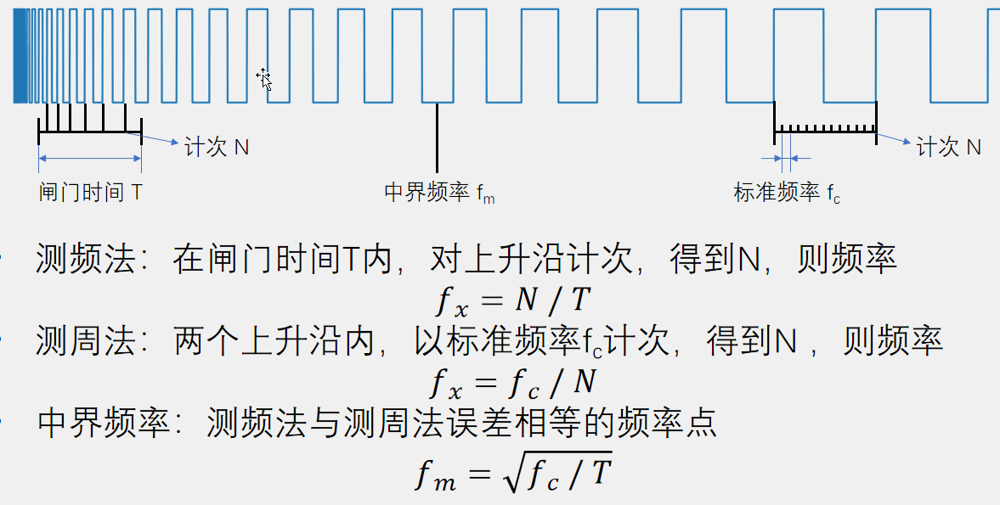
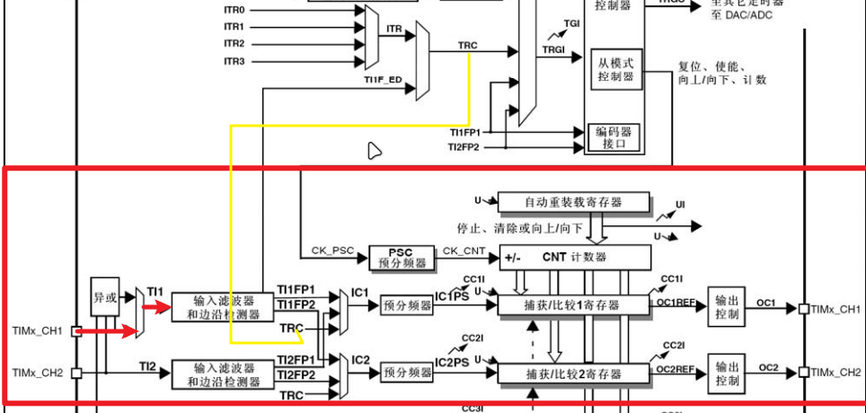
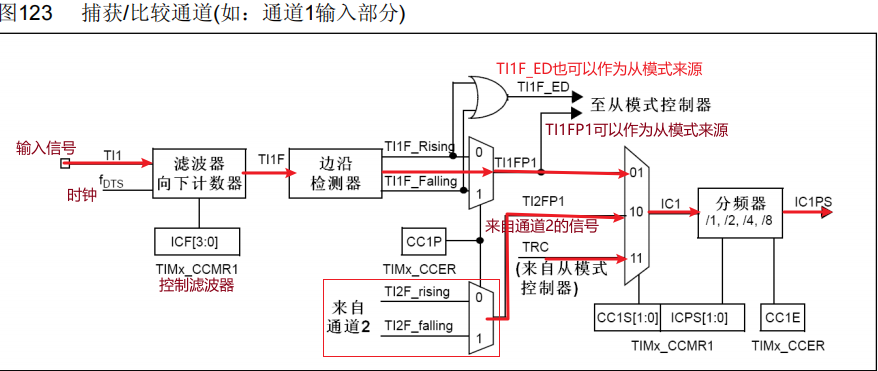
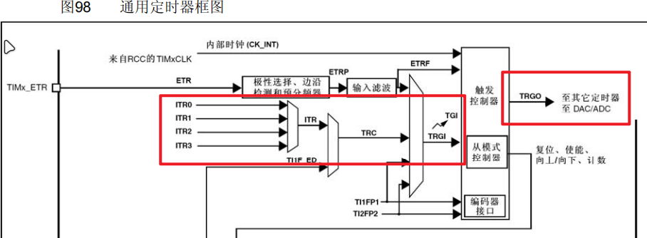
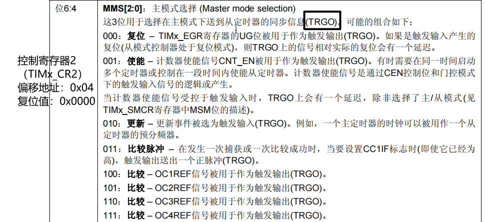
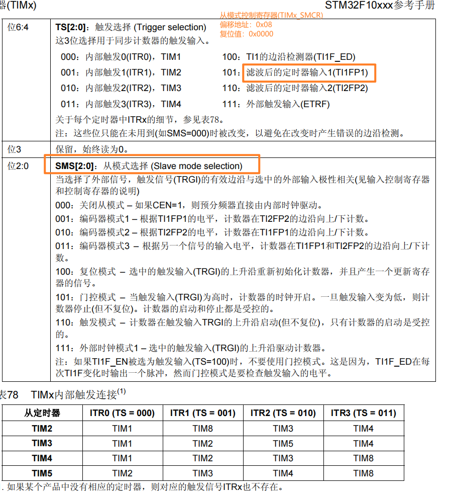
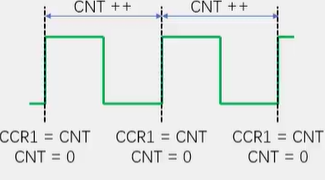
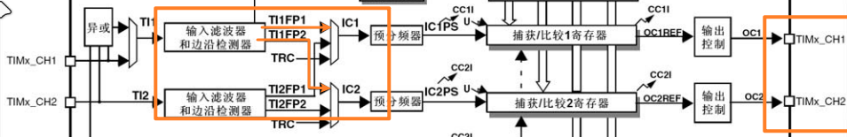
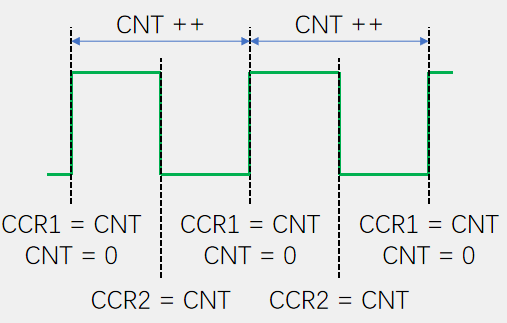

# 输入捕获 #

输入捕获模式下，当通道输入引脚出现指定电平跳变时，当前CNT的值将被锁存到CCR中，可用于测量PWM波形的频率、占空比、脉冲间隔、电平持续时间等参数。

可配置为PWMI模式，同时测量频率和占空比
可配合主从触发模式，实现硬件全自动测量

## 频率测量的方法



测频法：在规定时间T内，对上升沿或者下降沿的次数进行计数，适用于高频

测周法：在两个上升沿或者下降沿之间，统计基于标准频率的计数次数，适用于低频。1/Fc表示一个计数的时间，则N个计数的时间为N/Fc，这个是输入信号的周期，取倒数就是频率。

## 输入捕获框图



输入信号经过输入滤波和边沿检测，变为TI1FP1（TI2FP2），IC1的来源有三个：TRC、TI1FP1、TI2FP1（交叉），在经过预分频器得到IC1PS，触发将CNT的值存在CCR中，此处也可以设置中断或事件。



这是更详细的TIMxCH1部分框图：主要是TI1FP1可以作为从模式控制器的来源之一。

## 主从模式：

手册（定时器同步中有介绍）



### 主模式：

定时器可以给其他定时器或者ADC发送信号



### 从模式：

当其他定时器主模式发来某种信号时 或者 自身发来某信号时，自身应如何反应。（这里我们要用到其自身发来的信号，做出一定反应）



触发选择：谁来触发，从模式选择：触发后干什么

## 1、测量频率

### **解释**：

在此处采用测周法，即在标准频率下测量一个输入信号周期中，定时器的计数次数。



上升沿到来，CCR1=CNT，CNT=0（从模式），CNT继续++，上升沿到来，CCR1=CNT，CNT=0，此时的CCR1的值就是计数器在输入信号一个周期内的计数值N，标准频率就是PSC分频后驱动CNT计数的频率。

### **注意**：

CNT最大计数65535，CCR1始终为最新的一个周期内的计数值

### **流程**

-   1、配置GPIO    上拉输入 或者浮空 
-   2、配置时基单元  `TIM_TIMEBaseInit()` 
-   3、配置输入捕获单元 `TIM_ICInit()`
-   4、配置TRGI的触发源为TIFP1  `TIM_SelectInputTrigger()`
-   5、配置从模式，动作为Reset    `TIM_SelectSlaveMode()`
-   6、读取CCR寄存器，配合公式，获得频率

### **代码样例：**

此处测量输入为PA6--TIM3CH1

```c
void IC_Init(void)
{
	/*开启时钟*/
	RCC_APB1PeriphClockCmd(RCC_APB1Periph_TIM3, ENABLE);			
	RCC_APB2PeriphClockCmd(RCC_APB2Periph_GPIOA, ENABLE);	
    /*GPIO初始化*/
    GPIO_InitTypeDef GPIO_InitStructure;
    GPIO_InitStructure.GPIO_Mode = GPIO_Mode_IPU;
    GPIO_InitStructure.GPIO_Pin = GPIO_Pin_6;//将PA6引脚初始化为上拉输入
    GPIO_InitStructure.GPIO_Speed = GPIO_Speed_50MHz;
    GPIO_Init(GPIOA, &GPIO_InitStructure);							

    /*配置时钟源*/
    TIM_InternalClockConfig(TIM3);	

    /*时基单元初始化*/
    TIM_TimeBaseInitTypeDef TIM_TimeBaseInitStructure;				
    TIM_TimeBaseInitStructure.TIM_ClockDivision = TIM_CKD_DIV1;    
    TIM_TimeBaseInitStructure.TIM_CounterMode = TIM_CounterMode_Up; 
    TIM_TimeBaseInitStructure.TIM_Period = 65536 - 1;               
    TIM_TimeBaseInitStructure.TIM_Prescaler = 72 - 1;//  72M/72=1M  标准频率是1MHz              
    TIM_TimeBaseInitStructure.TIM_RepetitionCounter = 0;           
    TIM_TimeBaseInit(TIM3, &TIM_TimeBaseInitStructure);    

    /*IC初始化*/
    TIM_ICInitTypeDef TIM_ICInitStructure;							
    TIM_ICInitStructure.TIM_Channel = TIM_Channel_1;				//选择配置定时器通道1
    TIM_ICInitStructure.TIM_ICFilter = 0xF;						//输入滤波器参数，可以过滤信号抖动
    TIM_ICInitStructure.TIM_ICPolarity = TIM_ICPolarity_Rising;		//上升沿触发捕获
    TIM_ICInitStructure.TIM_ICPrescaler = TIM_ICPSC_DIV1;	//捕获预分频，选择不分频，每次信号都触发捕获
    TIM_ICInitStructure.TIM_ICSelection = TIM_ICSelection_DirectTI;	//输入信号交叉，选择直通，不交叉
    TIM_ICInit(TIM3, &TIM_ICInitStructure);						

    /*选择触发源及从模式  //即TI1产生上升沿时，会触发CNT归零*/
    TIM_SelectInputTrigger(TIM3, TIM_TS_TI1FP1);				//触发源选择TI1FP1
    TIM_SelectSlaveMode(TIM3, TIM_SlaveMode_Reset);				//从模式选择复位
                                                                
    /*TIM使能*/
    TIM_Cmd(TIM3, ENABLE);			//使能TIM3，定时器开始运行
}
```
利用公式得到输入信号频率

```c
/**
* 函    数：获取输入捕获的频率
* 参    数：无
* 返 回 值：捕获得到的频率
*/
uint32_t IC_GetFreq(void)
{
	return 1000000 / (TIM_GetCapture1(TIM3) + 1);		
	//测周法得到频率fx = fc / N，这里不执行+1的操作也可
}
```

## 2、PWMI模式 ##

### 作用:

PWMI用来测量占空比和频率，有一个信号输入，使用两个通道捕获，一个捕获周期，一个捕获高电平。

### 框图：



可以设置TF1FP1捕获上升沿，TF1FP2捕获下降沿，这样CCR2：CCR1就是占空比。



步骤和普通输入捕获的相似，但是在配置输入捕获单元时，还需要配置第二个通道，第二个通道用来检测下降沿，这样，由GPIO传进来的信号的上升沿和下降沿都能被捕获到，就可以计算出占空比。

在配置第二个通道时，可以使用TIM_PWMIConfig()，会自动改为相反的配置，不需要在手动改了。

### 关键代码

```c
/*PWMI模式初始化*/
	TIM_ICInitTypeDef TIM_ICInitStructure;							
	TIM_ICInitStructure.TIM_Channel = TIM_Channel_1;				//选择配置定时器通道1
	TIM_ICInitStructure.TIM_ICFilter = 0xF;							
	TIM_ICInitStructure.TIM_ICPolarity = TIM_ICPolarity_Rising;		//极性，选择为上升沿触发捕获
	TIM_ICInitStructure.TIM_ICPrescaler = TIM_ICPSC_DIV1;			
	TIM_ICInitStructure.TIM_ICSelection = TIM_ICSelection_DirectTI;	//输入信号交叉，选择直通，不交叉
    //此函数同时会把另一个通道配置为相反的配置，实现PWMI模式	
    TIM_PWMIConfig(TIM3, &TIM_ICInitStructure);	//将结构体变量交给TIM_PWMIConfig，配置TIM3的输入捕获通道
																	
```

占空比计算

 ```c
/**
  * 函    数：获取输入捕获的占空比
  * 参    数：无
  * 返 回 值：捕获得到的占空比
**/
uint32_t IC_GetDuty(void)
{
    return (TIM_GetCapture2(TIM3) + 1) * 100 / (TIM_GetCapture1(TIM3) + 1);	
    //占空比Duty = CCR2 / CCR1 * 100，这里不执行+1的操作也可
}
 ```

##  3、 编码器


