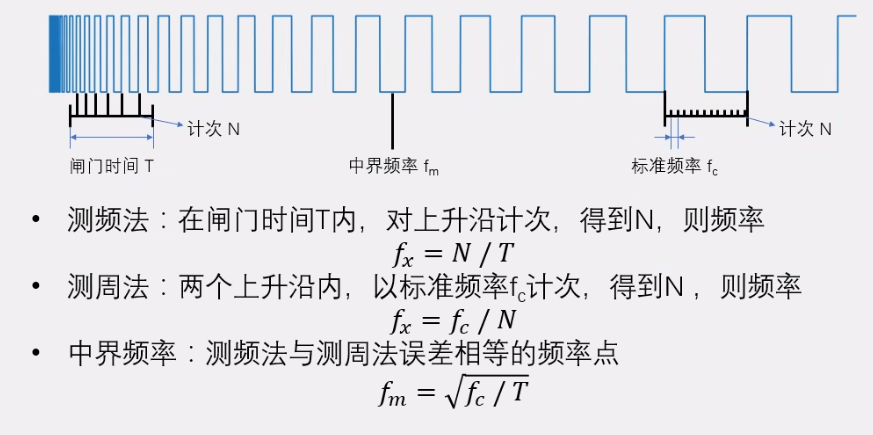
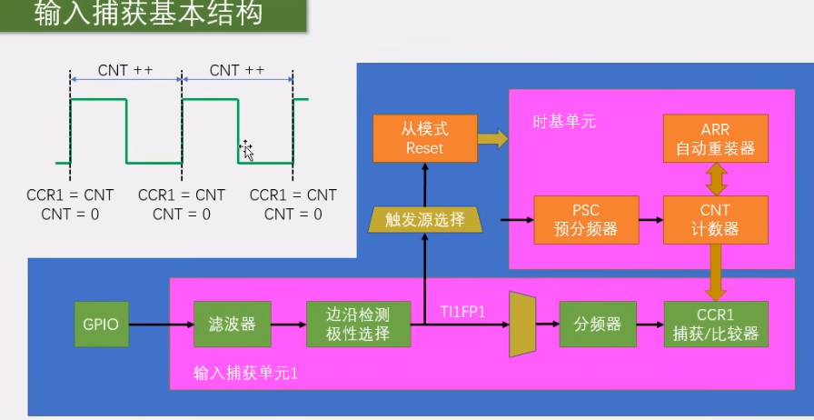
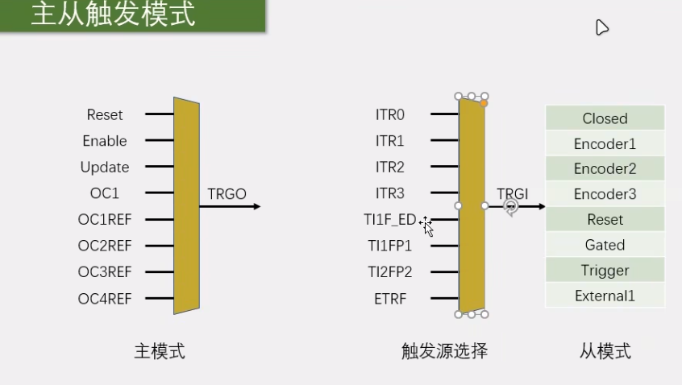
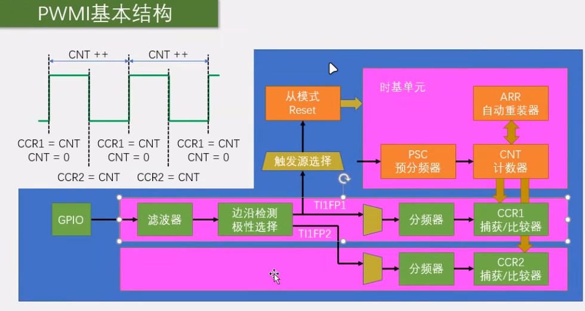

## 输入捕获 ##

输入捕获模式下，当通道输入引脚出现指定电平跳变时，当前CNT的值将被锁存到CCR中，可用于测量PWM波形的频率、占空比、脉冲间隔、电平持续时间等参数。

**频率测量**

测频法：在规定时间T内，对上升沿或者下降沿测次数进行计数，适用于高频

测周法：在两个上升沿或者下降沿之间，统计基于标准频率的计数次数，适用于低频。

### 测量频率

1、配置GPIO-一般上拉输入 GPIO_Init

2、配置时基单元  TIM_TIMEBaseInit() 

3、配置输入捕获单元 TIM_ICInit()

4、配置TRGI的触发源为TIFP1  TIM_SelectInputTrigger()

5、配置从模式，动作为Reset    TIM_SelectSlaveMode()

5、读取CCR寄存器，配合公式，获得频率

### PWMI模式 ###

步骤和上面的相似，但是在第三步配置输入捕获单元时，还需要配置第二个通道，第二个通道用来检测下降沿，这样，由GPIO传进来的信号的上升沿和下降沿都能被捕获到，就可以计算出占空比。

在配置第二个通道时，可以使用TIM_PWMIConfig()，会自动改为相反的配置，不需要在手动改了。

