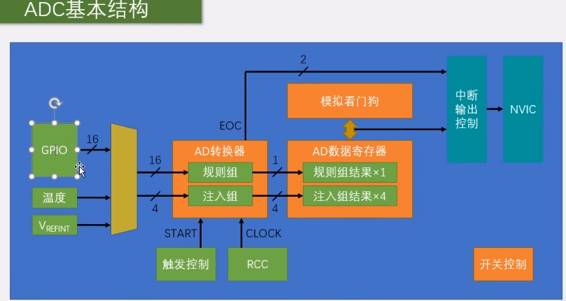
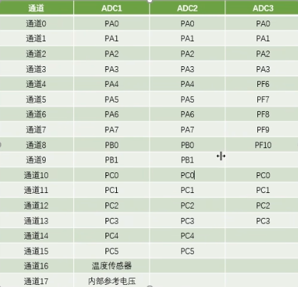
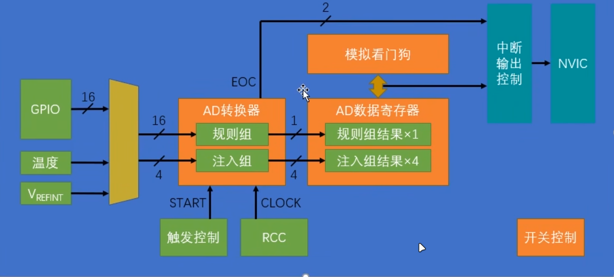

## ADC

ADC：模拟-数字转换器

ADC可以将引脚上连续变化的模拟电压转变为内存中存储的数字变量，建立模拟电路到数字电路的桥梁

12位逐次逼近型ADC，1us转换时间

输入电压0-3.3v  转换范围结果0-4095

1、初始化GPIO

2、设置ADC，设置ADC时钟

3、设置规则组

4、开启ADC

5、校准

6、获取ADC数值（1、触发ADC；2、等待完成；3、读取）