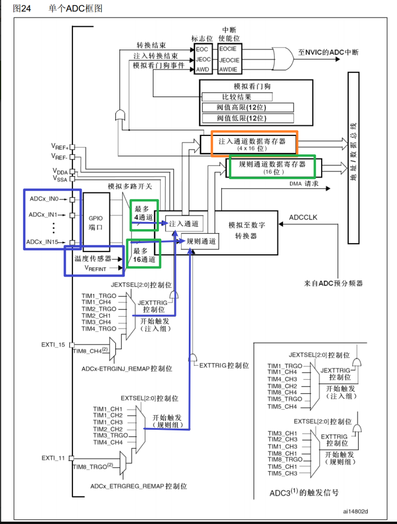
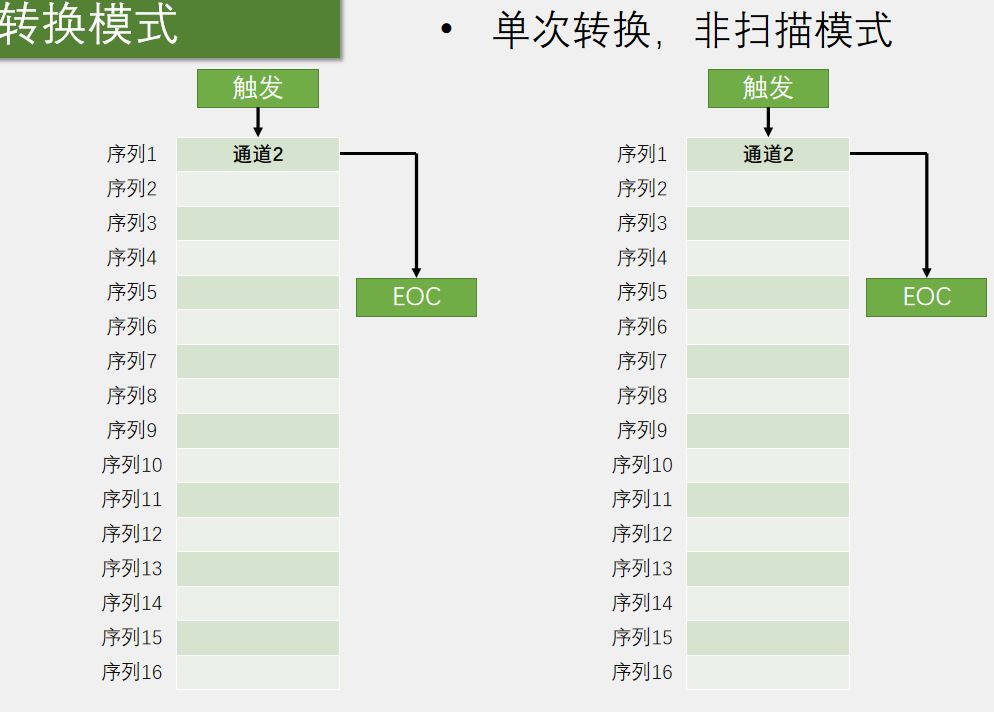
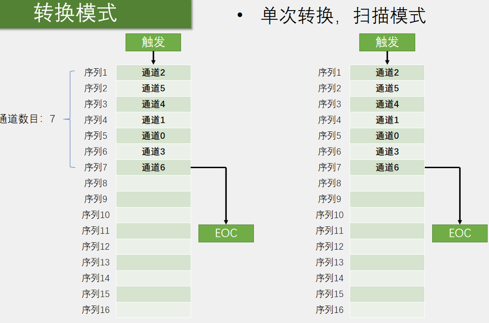
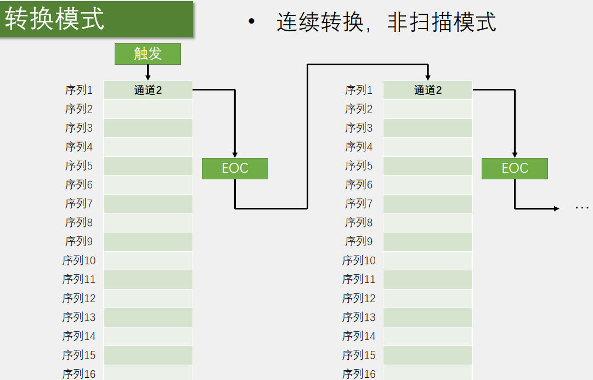
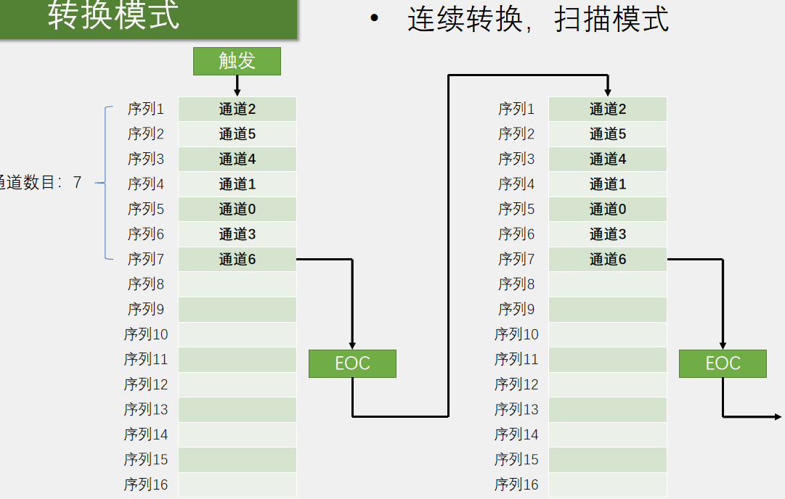

# ADC

## 概念

众所周知，GPIO只能读入高电平或者低电平，那如果现有一个模拟量，该如何读取呢，比如电压的范围是0~3.3v，如何获取电压的值。就需要ADC（Analog-Digital Converter）了。ADC可以将引脚上连续变化的模拟电压转变为内存中存储的数字变量，建立模拟电路到数字电路的桥梁。

stm32f103自带的是12位逐次逼近型ADC，1us转换时间，这样最多可以输出0-4095的数字量。

## 框图



蓝色框，表示ADC有18个数据来源通道：ADCx_IN0~15、和内部的温度传感器、Verfint。

绿色框，表示注入组最多可以同时转化4个（所谓同时，其实是依次）。规则组最多可以同时转化16个数据。

橙色框：需要注意的是，注入通道数据寄存器有4个，转化好的数据一人一个；而规则通道数据寄存器只有一个，16个转好的数据共用一个。

蓝色箭头：ADC转化的触发源可以如图选择：外部中断触发、TIM...触发、内部软件触发。


## ADC转化模式和扫描模式

**单次转化 非扫描模式：**只转化一次，就停止转化；不管配置几个数据源，只转化第一个，发出EOC信号。



**单次转化  扫描模式：**只转化一次，就停止转化；配置多个数据源，会依次转化完，然后发出EOC信号。



**连续转化 非扫描模式：**本轮转化结束后自动开始下一轮；不管配置几个数据源，只转化第一个，发出EOC信号。



**连续转化 扫描模式：**本轮转化结束后自动开始下一轮：配置多个数据源，会依次转化完，然后发出EOC信号。




## 单通道模式

### 流程：

1.  初始化GPIO    模拟输入模式
2.  设置ADC时钟 `RCC_ADCCLKConfig()`
3.  设置ADC  `ADC_Init()`
4.  设置规则组 `ADC_RegularChannelConfig`
5.  使能ADC
6.  校准（4个函数）
6.  触发，开始转换

### 代码

```c
void AD_Init()
{
    // PA0 引脚初始化
    RCC_APB2PeriphClockCmd(RCC_APB2Periph_GPIOA, ENABLE);
    GPIO_InitTypeDef GPIO_InitStruct;
    GPIO_InitStruct.GPIO_Mode = GPIO_Mode_AIN;
    GPIO_InitStruct.GPIO_Pin = GPIO_Pin_0;
    GPIO_Init(GPIOA, &GPIO_InitStruct);

    //ADC时钟使能
    RCC_APB2PeriphClockCmd(RCC_APB2Periph_ADC1, ENABLE);
    RCC_ADCCLKConfig(RCC_PCLK2_Div6);//ADC内部时钟，PCLK2意为APB2总线时钟
    
    // 设置ADC ADC初始化
    ADC_DeInit(ADC1);  //复位ADC1 
    ADC_InitTypeDef ADC_InitStruct;
    ADC_InitStruct.ADC_Mode = ADC_Mode_Independent;//ADC独立模式
    ADC_InitStruct.ADC_ScanConvMode =DISABLE;//非扫描（因为只有一个通道，不需要扫描）
    ADC_InitStruct.ADC_ContinuousConvMode = ENABLE;//连续转化
    ADC_InitStruct.ADC_DataAlign = ADC_DataAlign_Right;//右对齐数据
    ADC_InitStruct.ADC_ExternalTrigConv = ADC_ExternalTrigConv_None;//外部触发 NONE
    ADC_InitStruct.ADC_NbrOfChannel = 1; //要配置几个通道，这里是一个
    ADC_Init(ADC1, &ADC_InitStruct);
    
    // 配置规则组 ADC1 通道0的优先级是1，采样时间1.5   如果是多个通道，就多次配置该函数
    ADC_RegularChannelConfig(ADC1,ADC_Channel_0,1,ADC_SampleTime_1Cycles5);
    ADC_Cmd(ADC1, ENABLE);

    // ADC校准
    ADC_ResetCalibration(ADC1);
    while(ADC_GetResetCalibrationStatus(ADC1));
    ADC_StartCalibration(ADC1);
    while(ADC_GetCalibrationStatus(ADC1));

    // ADC软件触发转换
    ADC_SoftwareStartConvCmd(ADC1, ENABLE);

}

//获取ADC转化后的原始数值
uint16_t AD_GetValue()
{
    // 获取ADC的EOC标志位，转换完成置SET
    while(!ADC_GetFlagStatus(ADC1, ADC_FLAG_EOC));
    // 获取值，读ADC的DR寄存区，读完后，会自动降EOC置RESET
    return  ADC_GetConversionValue(ADC1);
}
```

注：RCC时钟不仅要开启GPIO和ADC的，还要配置ADC内部的时钟，这个时钟来自于APB2总线时钟。

## 多通道模式（手动，非DMA） ##


如上就可以被称为多通道，四个模拟量接入PA0-PA3，

这是我们设置扫描模式，使用ADC1CH0-CH3


这里的四个通道有数据后，都往DR寄存器中写数据，如果不适用DMA转存，就会被覆盖。当四个通道的数据都搬运完后，才会发出一个EOC信号。

因为本节不涉及DMA，因此推荐另一种手动方法，使用非连续非扫描模式。该模式下，依次转化一个通道的数据，然后停止。

在该模式下，每次我们读取值之前，都设置将要读取的通道设置，然后触发，等待EOC，读值。与单通道模式相似。

```c
//轮流多次配置规则组已达到多通道效果
uint16_t AD_GetValue_CHS(uint8_t ADC_Channel)
{
    // 配置规则组 ADC1 通道0的优先级是1，采样时间1.5   如果是多个通道，就多次配置该函数
    ADC_RegularChannelConfig(ADC1,ADC_Channel,1,ADC_SampleTime_1Cycles5);
    // ADC软件触发转换
    ADC_SoftwareStartConvCmd(ADC1, ENABLE);
    // 获取ADC的EOC标志位，转换完成置SET
    while(!ADC_GetFlagStatus(ADC1, ADC_FLAG_EOC));
    // 获取值，读ADC的DR寄存区，读完后，会自动降EOC置RESET
    return  ADC_GetConversionValue(ADC1);
}

```

根据形参选择通道