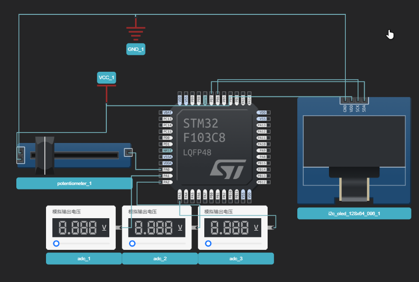
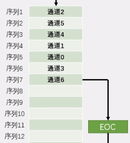

## ADC

ADC：模拟-数字转换器

ADC可以将引脚上连续变化的模拟电压转变为内存中存储的数字变量，建立模拟电路到数字电路的桥梁

12位逐次逼近型ADC，1us转换时间

输入电压0-3.3v  转换范围结果0-4095


### 单通道模式 ###

1.  初始化GPIO    模拟输入模式
2.  设置ADC时钟 `RCC_ADCCLKConfig()`
3.  设置ADC  `ADC_Init()`
4.  设置规则组 `ADC_RegularChannelConfig`

5.  使能ADC
6.  校准（4个函数）

注：RCC时钟不仅要开启GPIO和ADC的，还要配置ADC内部的时钟，这个时钟来自于APB2总线时钟。

ADC_ScanConvMode 、ADC_ContinuousConvMode搭配有四个模式：连续扫描、连续非扫描、非连续扫描、非连续非扫描。

### 多通道模式 ###



如上就可以被称为多通道，四个模拟量接入PA0-PA3，

这是我们设置扫描模式，使用ADC1CH0-CH3



这里的四个通道有数据后，都往DR寄存器中写数据，如果不适用DMA转存，就会被覆盖。当四个通道的数据都搬运完后，才会发出一个EOC信号。

因为本节不涉及DMA，因此推荐另一种手动方法，使用非连续非扫描模式。

在该模式下，每次我们读取值之前，都设置将要读取的通道设置，然后触发，等待EOC，读值。于丹通道模式相似。

```c
//轮流多次配置规则组已达到多通道效果
uint16_t AD_GetValue_CHS(uint8_t ADC_Channel)
{
    // 配置规则组 ADC1 通道0的优先级是1，采样时间1.5   如果是多个通道，就多次配置该函数
    ADC_RegularChannelConfig(ADC1,ADC_Channel,1,ADC_SampleTime_1Cycles5);
    // ADC软件触发转换
    ADC_SoftwareStartConvCmd(ADC1, ENABLE);
    // 获取ADC的EOC标志位，转换完成置SET
    while(!ADC_GetFlagStatus(ADC1, ADC_FLAG_EOC));
    // 获取值，读ADC的DR寄存区，读完后，会自动降EOC置RESET
    return  ADC_GetConversionValue(ADC1);
}

```

根据形参选择通道