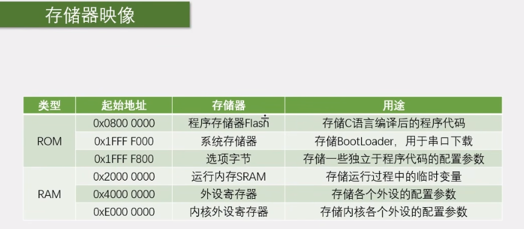
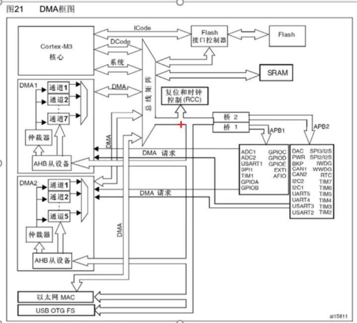
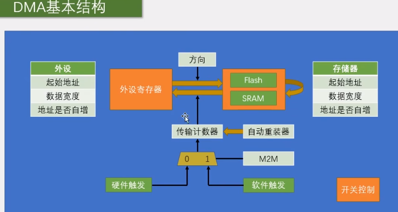
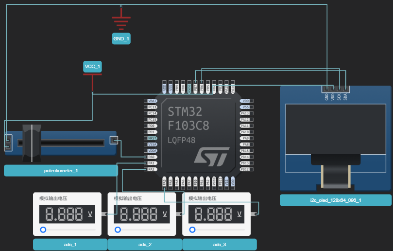

# DMA

直接存储器存取：可以提供外设和存储器或存储器之间的高速运转，无需CPU。DMA可以直接访问芯片的ROM、RAM、寄存器。

12个独立可配置的通道：DMA1（7个通道），DMA2（5个通道）

每个通道都支持软件触发和特定的硬件触发



STM32内部的存储器 



DMA框图：DMA1通过DMA总线----总线矩阵----APB---访问各个外设的寄存器，各个外设通过DMA请求来触发DMA操作，CPU通过系统---总线矩阵---AHB从设备来设置DMA。DMA中的诸多通道服用一个DMA总线，通过仲裁器来决定



DMA从外设起始地址找数据搬运到存储器起始地址，其中外设地址可以设置为Flash、SRAM，这样就是存储器转运到存储器。

传输计数器：转运一次，计数器-1，为0时结束本轮的转运，自增的地址会回到起始地址；如果设置了自动重装器，计数器到0后，会自动重装，然后开始下一轮的转运。

M2M设置触发方式，这里的软件触发会连续不断地触发。硬件触发可以选择ADC、串口等外设。外设发送DMA信号触发。

**PS：写传输计数器时，必须线disable  DMA_Cmd()**

**PS：DMA工作的三个条件：1、DMA使能；2、DMA计数器不为零；3、DMA有触发源**

## DMA数据转运

从内存转到内存，设置两个数组A、B，使用DMA将A数据搬运至B

设置外设、存储器的起始地址、数据宽度、自增

```c
DMA_InitStruct.DMA_PeripheralBaseAddr = ADDR_P;
DMA_InitStruct.DMA_PeripheralDataSize = DMA_PeripheralDataSize_Byte;
DMA_InitStruct.DMA_PeripheralInc = DMA_PeripheralInc_Enable;
DMA_InitStruct.DMA_MemoryDataSize = DMA_MemoryDataSize_Byte;
DMA_InitStruct.DMA_MemoryBaseAddr = ADDR_M;
DMA_InitStruct.DMA_MemoryInc = DMA_MemoryInc_Enable;
```

设置方向

```c
DMA_InitStruct.DMA_DIR = DMA_DIR_PeripheralSRC;//方向选择  P-》M
```

设置计数器、自动重装载

```C
DMA_InitStruct.DMA_BufferSize = buffer_size;//计数器
DMA_InitStruct.DMA_Mode = DMA_Mode_Normal;//自动化重装： 否
```

设置触发方式、优先级

```C
DMA_InitStruct.DMA_M2M = DMA_M2M_Enable;//软件触发
DMA_InitStruct.DMA_Priority = DMA_Priority_Medium;
```

DMA_Cmd使能开始搬运

```C
DMA_Cmd(DMA1_Channel1, ENABLE);
```

## DMA+ADC多通道



设计思路：ADC不断地获取四个通道的数据，放到DR寄存器中，DMA不断地从ADC->DR中获取数据搬运到指定的位置。其中的模式ADC为扫描模式（扫描4个通道），连续模式（触发开始后不断循环下一轮）；DMA为自动重装模式，外部触发（ADC的DMA信号触发）

```c
extern u16 ADC_VALUE[4];
// 利用DMA完成多通道
void ADC_DMA_Init()
{
    //-------------------ADC配置------------------------------------------------
    //  1.  初始化GPIO    模拟输入模式
    RCC_APB2PeriphClockCmd(RCC_APB2Periph_ADC1 |RCC_APB2Periph_GPIOA,ENABLE);
    GPIO_InitTypeDef GPIO_InitStruct;
    GPIO_InitStruct.GPIO_Mode = GPIO_Mode_AIN;
    GPIO_InitStruct.GPIO_Pin = GPIO_Pin_0 | GPIO_Pin_1 | GPIO_Pin_2 | GPIO_Pin_3;
    GPIO_Init(GPIOA,&GPIO_InitStruct);
    // 2.  设置ADC时钟 `RCC_ADCCLKConfig()
    RCC_ADCCLKConfig(RCC_PCLK2_Div6);
    // 3.  设置ADC  `ADC_Init()` 独立模式、软件触发
    ADC_InitTypeDef ADC_InitStruct;
    ADC_InitStruct.ADC_Mode = ADC_Mode_Independent;
    ADC_InitStruct.ADC_DataAlign = ADC_DataAlign_Right;
    ADC_InitStruct.ADC_ExternalTrigConv = ADC_ExternalTrigConv_None;//ADC软件触发，即ADC_SoftwareStartConvCmd(ADC1, ENABLE);
    ADC_InitStruct.ADC_ScanConvMode = ENABLE;//扫描模式
    ADC_InitStruct.ADC_ContinuousConvMode = ENABLE;//连续转换：
    ADC_InitStruct.ADC_NbrOfChannel = 4;//扫描前四个
    ADC_Init(ADC1,&ADC_InitStruct);
    // 4.  设置规则组 `ADC_RegularChannelConfig`
    ADC_RegularChannelConfig(ADC1, ADC_Channel_0, 1, ADC_SampleTime_55Cycles5);
    ADC_RegularChannelConfig(ADC1, ADC_Channel_1, 2, ADC_SampleTime_55Cycles5);
    ADC_RegularChannelConfig(ADC1, ADC_Channel_2, 3, ADC_SampleTime_55Cycles5);
    ADC_RegularChannelConfig(ADC1, ADC_Channel_3, 4, ADC_SampleTime_55Cycles5);
    // 5.1  使能ADC
    ADC_Cmd(ADC1, ENABLE);
    // 5.2  ADC的DMA信号使能
    ADC_DMACmd(ADC1, ENABLE);
    // 6.  校准（4个函数）
    ADC_ResetCalibration(ADC1);
    while(ADC_GetResetCalibrationStatus(ADC1));
    ADC_StartCalibration(ADC1);
    while(ADC_GetCalibrationStatus(ADC1));

    

    // -------------------DMA配置-------------------------------------------------------

    //1、DMA时钟
    RCC_AHBPeriphClockCmd(RCC_AHBPeriph_DMA1, ENABLE);

    //2、DMA搬运源（外设）和目的（存储器）设置
    DMA_InitTypeDef DMA_InitStruct;
    DMA_InitStruct.DMA_PeripheralBaseAddr = (u32)&ADC1->DR;//源是ADC1的DR寄存器
    DMA_InitStruct.DMA_PeripheralDataSize = DMA_PeripheralDataSize_HalfWord;//
    DMA_InitStruct.DMA_PeripheralInc = DMA_PeripheralInc_Disable;

    DMA_InitStruct.DMA_MemoryBaseAddr = (u32)ADC_VALUE;
    DMA_InitStruct.DMA_MemoryDataSize = DMA_MemoryDataSize_HalfWord;
    DMA_InitStruct.DMA_MemoryInc = DMA_MemoryInc_Enable;


    // 3、DMA模式配置
    DMA_InitStruct.DMA_DIR = DMA_DIR_PeripheralSRC;//方向选择  P-》M
    DMA_InitStruct.DMA_BufferSize = 4;//计数器
    DMA_InitStruct.DMA_Mode = DMA_Mode_Circular;//自动化重装： 是
    DMA_InitStruct.DMA_M2M = DMA_M2M_Disable;//ADC的DMA信号触发DMA转换
    
    DMA_InitStruct.DMA_Priority = DMA_Priority_Medium;
    DMA_Init(DMA1_Channel1,&DMA_InitStruct);

    // DMA使能:先暂时关闭，等getvalue时再开启
    DMA_Cmd(DMA1_Channel1, ENABLE);


    ADC_SoftwareStartConvCmd(ADC1, ENABLE);//AD软件触发使ADC开始工作

    // 获取ADC的EOC标志位，转换完成置SET
    while(!ADC_GetFlagStatus(ADC1, ADC_FLAG_EOC));

}
```

