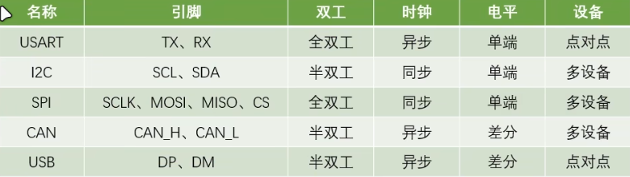
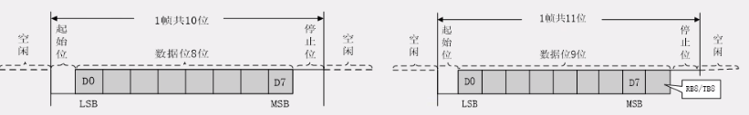
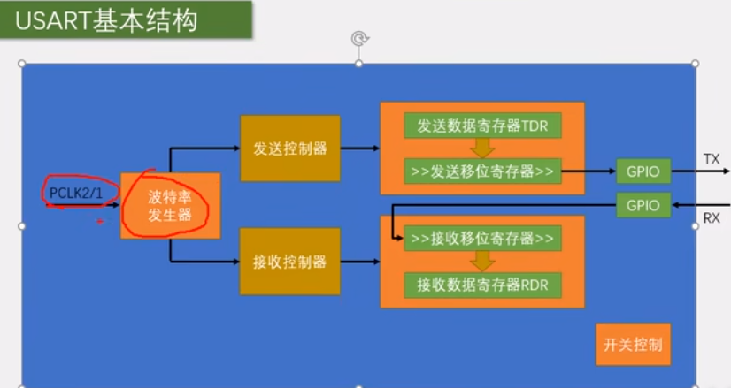
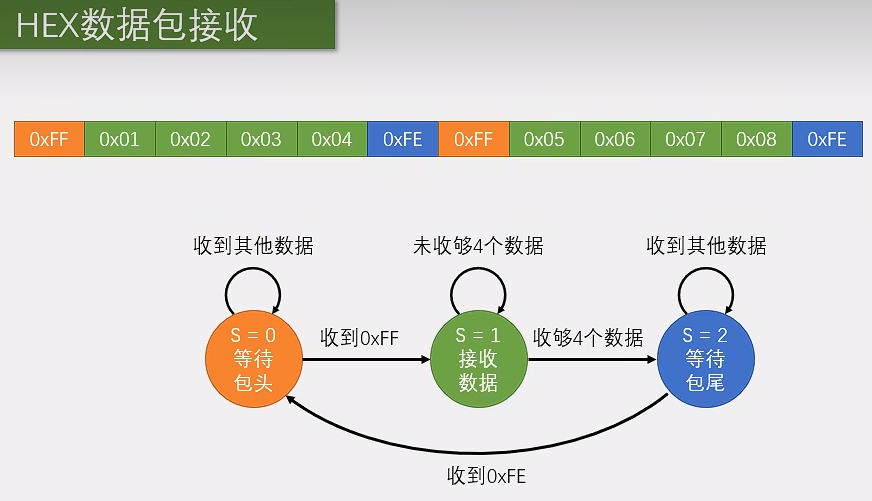
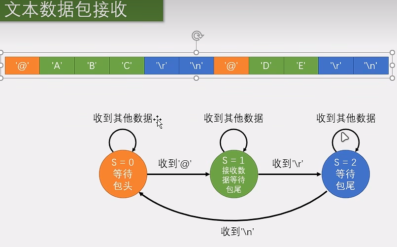

# USART #

### 通信协议

通讯的目的是将一个设备的数据传输到另一个设备，STM32内部的通信协议有如下：



两个设备的 TX TR要交叉连接

### 串口常用的电平标准

| 电平标准 |  表示1   |  表示0   |
| :------: | :------: | :------: |
|   TTL    | 3.3 ~ 5  |    0     |
|  RS232   | -3 ~ -15 | +3 ~ +15 |
|  RS485   | +2 ~ +6  | -2 ~ -6  |

### 串口数据格式



**串口空闲状态为高电平**，一个数据帧包括 **起始位**、**数据位**、**停止位**。

校验位（可选）跟在数据位后面，此时数据位为9位。校验位使用奇偶校验。

-   波特率：每秒传输的码元数；
-   起始位：数据帧开始，固定为低电平
-   数据位：1高电平 0低电平
-   校验位：数据校验
-   停止位：数据帧间隔，固定为高电平

PS：**低位先行**：如发送0x65，即0110 0101   则从低位依次发送1、0、1、0、0、1、1、0。        接收时先接受的是低位。

###  USART ----STM32内部的外设

-   usart是stm32内部集成的硬件外设，可**根据数据寄存器TDR的一个字节数据自动生成数据帧时序，从TX引脚发送出去**，也可以**自动接收RX引脚的数据帧时序，拼接为一个字节数据，存放在数据寄存器RDR中**。
-   自带波特率发生器（就是**分频器**），最高支持4.5Mbits/s
-   可配置数据位长度（8/9）、停止位长度（0.5、1、1.5、2）
-   可选校验位（无、奇、偶）
-   支持同步模式、硬件流控制、**DMA**、智能卡、IrDA、LIN



### USART使用

1.  RCC开启GPIO、USART时钟
2.  GPIO设置（TX-复用推挽输出、RX-上拉输入\浮空输入）
3.  USART设置：波特率、数据位宽、停止位、校验位、硬件流控、模式
4.  开启USART中断（如接收可开启USART_IT_RXNE）
5.  中断NVIC设置
6.  使能USART
7.  USART_SendData发送、USART_ReceiveData接收
8.  如需接收，要设置接受中断服务函数

**标志位信息**

USART_IT_RXNE：接收中断标志位，该位为SET标志可以接收

USART_FLAG_TXE：发送标志位，该位为SET，表示发送完毕，可以写入下一个数据

### 函数实现

```c
void USART1_Init(u32 baudRate)
{
    //pa9-usart1_tx
    //pa10-usart1_rx
    RCC_APB2PeriphClockCmd(RCC_APB2Periph_USART1, ENABLE);	//开启USART1的时钟
	RCC_APB2PeriphClockCmd(RCC_APB2Periph_GPIOA, ENABLE);	//开启GPIOA的时钟
    // RCC_APB2PeriphClockCmd(RCC_APB2Periph_AFIO, ENABLE);

    // GPIO设置  TX---复用推挽输出   RX------上拉输入/浮空输入
    GPIO_InitTypeDef GPIO_InitStruct;
    GPIO_InitStruct.GPIO_Mode = GPIO_Mode_AF_PP;
    GPIO_InitStruct.GPIO_Pin = GPIO_Pin_9;
    GPIO_InitStruct.GPIO_Speed = GPIO_Speed_50MHz;
    GPIO_Init(GPIOA, &GPIO_InitStruct);

    GPIO_InitStruct.GPIO_Mode = GPIO_Mode_IN_FLOATING;
    GPIO_InitStruct.GPIO_Pin = GPIO_Pin_10;
    GPIO_Init(GPIOA, &GPIO_InitStruct);

    // USART设置
    USART_InitTypeDef USART_InitStructure;
	USART_InitStructure.USART_BaudRate = baudRate;										//串口波特率
	USART_InitStructure.USART_WordLength = USART_WordLength_8b;						//字长为8位数据格式
	USART_InitStructure.USART_StopBits = USART_StopBits_1;							//一个停止位
	USART_InitStructure.USART_Parity = USART_Parity_No;								//无奇偶校验位
	USART_InitStructure.USART_HardwareFlowControl = USART_HardwareFlowControl_None; //无硬件数据流控制
	USART_InitStructure.USART_Mode = USART_Mode_Rx | USART_Mode_Tx;					//收发模式
    USART_Init(USART1, &USART_InitStructure);
    //开USART1接收中断
    USART_ITConfig(USART1, USART_IT_RXNE, ENABLE);

    // NVIC设置
    NVIC_InitTypeDef NVIC_InitStruct;
    NVIC_InitStruct.NVIC_IRQChannel = USART1_IRQn;
    NVIC_InitStruct.NVIC_IRQChannelCmd = ENABLE;
    NVIC_InitStruct.NVIC_IRQChannelPreemptionPriority = 2;
    NVIC_InitStruct.NVIC_IRQChannelSubPriority = 2;
    NVIC_Init(&NVIC_InitStruct);

    // 使能
    USART_Cmd(USART1, ENABLE);

}
```


### 串口数据包



**现象**


