# IIC 

## 概念

同步、半双工、带数据应答、总线挂在多设备（一主多从、多主多从）

SCL时钟线、SDA数据线、所有IIC设备的SCL连在一起，SDA连在一起。均设置为**开漏输出模式**（SDA和SCL又上拉电阻，闲置状态下设置为开漏输出，电平会上拉，谁发信号就会下拉。）

## 时序

起始条件：SCL高期间，SDA下降沿

终止条件：SCL高期间，SDA上升沿

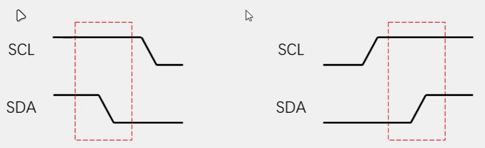

主机发送一位：SCL低电平期间，主机将数据放到SDA线上，然后释放SCL，从机将在SCL高电平期间读取数据位，所以SCL高电平期间SDA不允许有数据变化，依次循环上述过程8次，即可发送一个字节：**高位先行**。

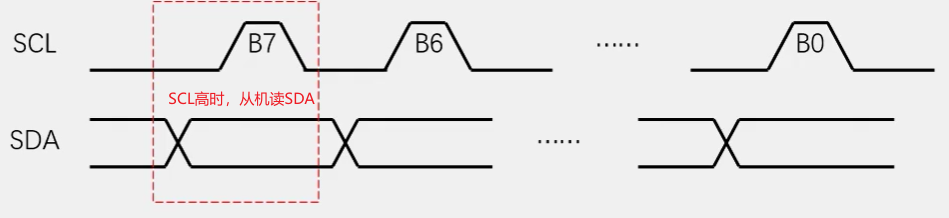

主机接收一位：SCL低电平期间，从机将数据放到SDA上，然后释放SCL，主机将在SCL高电平期间读，循环8次，接收一个字节，高位先行，

PS：主机在接收之前，需要释放SDA，交由从机控制。

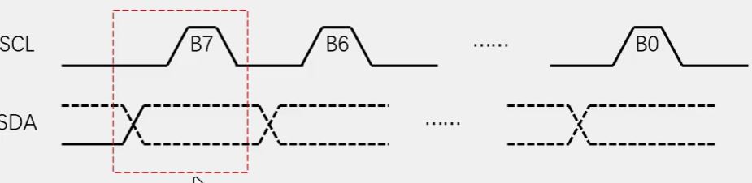

发送应答：主机在接收完一个字节，发送一位数据 0，应答，1非应答；

接收应答：主机在发送完一个字节后，接收从机发来的应答，0 应答，1 非应答。

MPU6050   AT24C02  OLED0.96 0

设备地址7位，第8位是读写标志位

**指定地址写：**对于指定设备，对指定地址写数据。

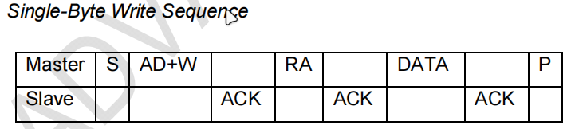

开始-地址+写-应答-寄存器地址-应答-数据-应答-停止

**当前地址读：**对于指定设备，读*当前指针地址下*的数据：发送完读标志位之后，主机放开SDA，从机管理SDA，因此无法指定读哪一块的数据。但是从机内部有一个数据栈指针P，默认就是发送P指向的数据，操作完之后自动P++。

在指定地址写完之后，其实指定的地址就更改了P的指向，写完之后P++。可以利用这一点完成指定地址读。

**指定地址读**：指定地址写+当前地址读。

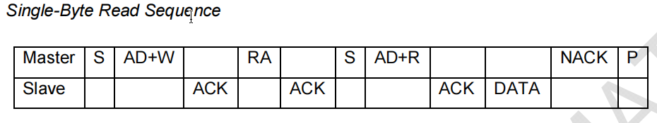

开始-地址+写-应答-寄存器地址-应答-开始-地址+读-应答-数据-非应答-停止

## MPU6050

3轴加速度计(*Accelerometr*):XYZ加速度；3轴陀螺仪传感器(*Gyroscope*)：XYZ角速度。通过**数据融合算法**可以得到姿态角（欧拉角），用于平衡车、飞行器等。

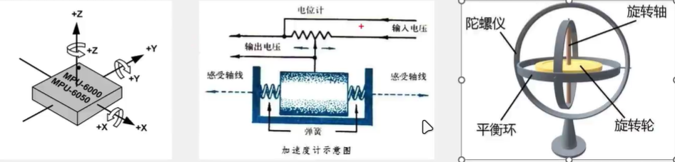

-   16位ADC:-32768 ~ 32767
-   加速度满量程选择±2、±4、±8、±16（g
-   陀螺仪量程 ±250、±500、±1000、±2000（°/sec
-   可配置的数字低通滤波器
-   可配置时钟源
-   可配置采样分频
-   IIC从机地址（1101000   1101001）

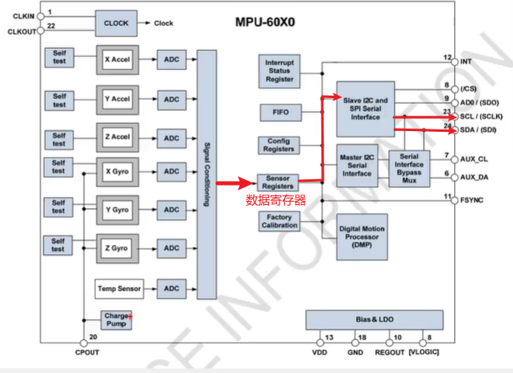


开始-地址+写-应答-寄存器地址-应答-数据-应答-停止


开始-地址+写-应答-寄存器地址-应答-开始-地址+读-应答-数据-非应答-停止

```c
// 接收应答
uint8_t My_IIC_RevACK()
{
    my_IIC_W_SDA(1);
    my_IIC_W_SCL(1);
    uint8_t ACK = my_IIC_R_SDA();
    my_IIC_W_SCL(0);
    return ACK;
}
```

PS：IIC的引脚都是开漏输出模式+若上拉电阻，`my_IIC_W_SDA(1);`。并不是SDA置高电平，而是释放SDA；并且IIC这是需要从机写数据，不能占用SDA。

## IIC外设（硬件IIC）

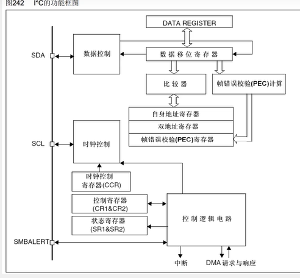

-   当DR数据转到移位寄存器中时，就会置TXE为空，表示发送寄存器为空，可以写数据
-   当移位寄存器数据转移到DR时，就会置RXNE为空，表示接受寄存器为空，可以读数据

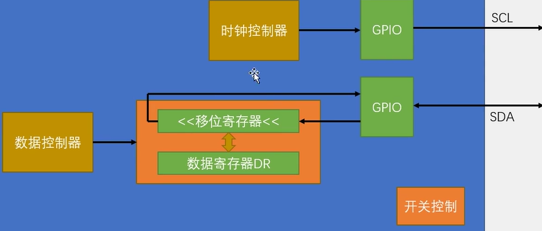

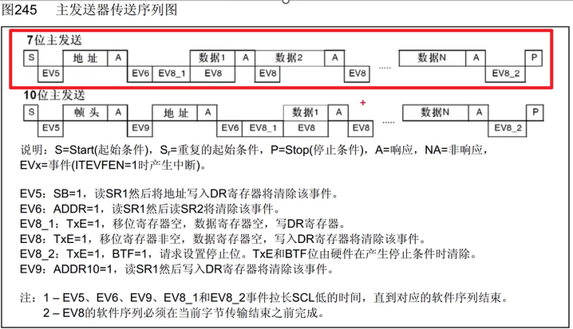

1.  CR产生S，起始条件，EV5表示起始条件已发送，
2.  DR  地址+写，接收应答，EV6表示地址发送结束，
3.  EV8_1表示移位寄存器和数据寄存器为空，可以写数据
4.  DR  数据 ，EV8：数据从DR转移到了移位寄存器，DR空，可写
5.  EV8_2 表示DR和移位寄存器为空，数据已发送完。
6.  CR产生停止条件P

起始--EV5--发送地址+写--接收应答-EV6--EV81--发送数据--EV82--停止

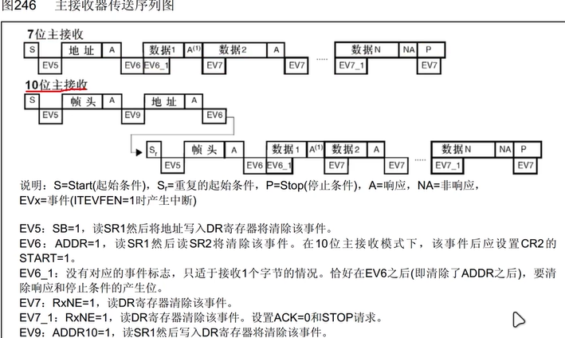

*指定地址读的模式也可以自己写。*

如何读和写已在代码注释中体现：`SYSTEM/iic/iic.h`
