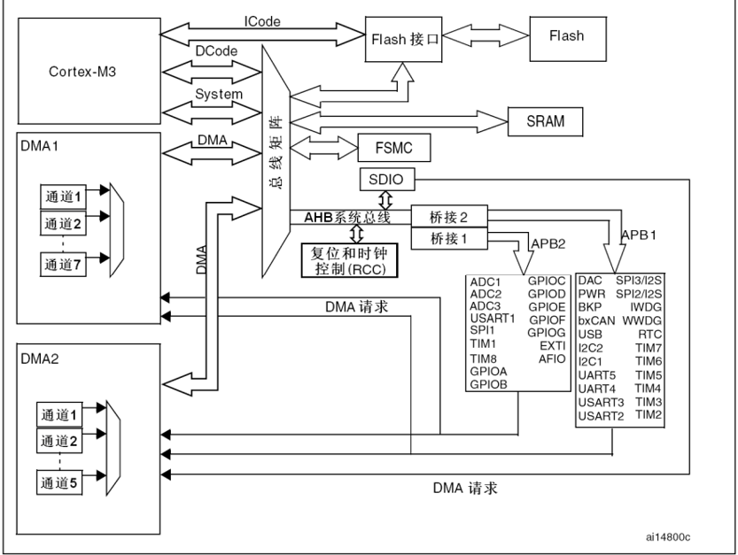
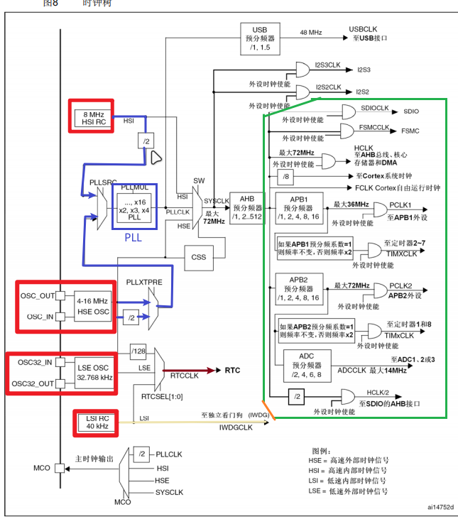
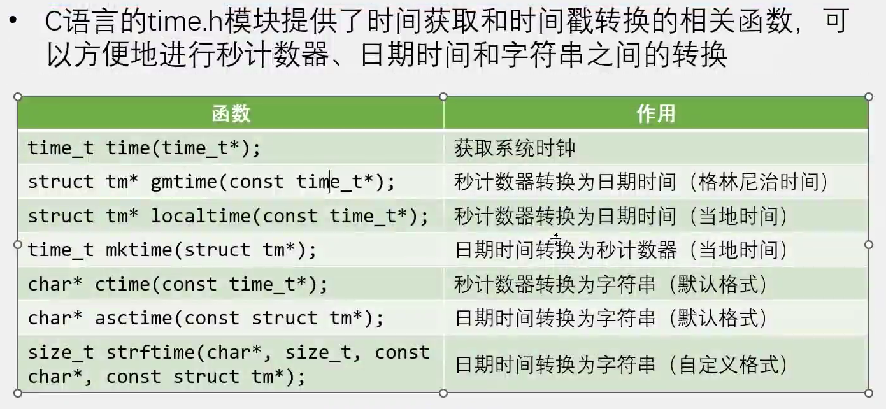
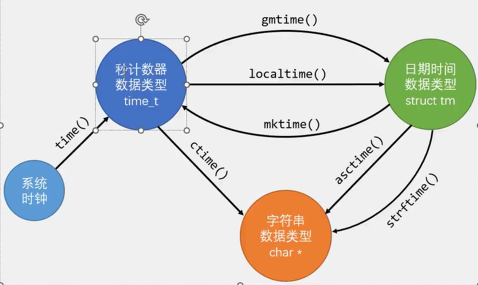
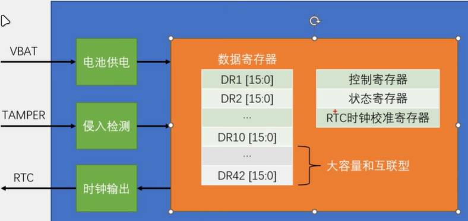
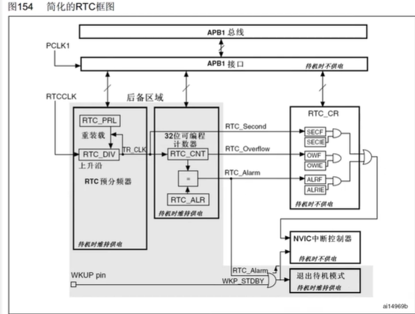
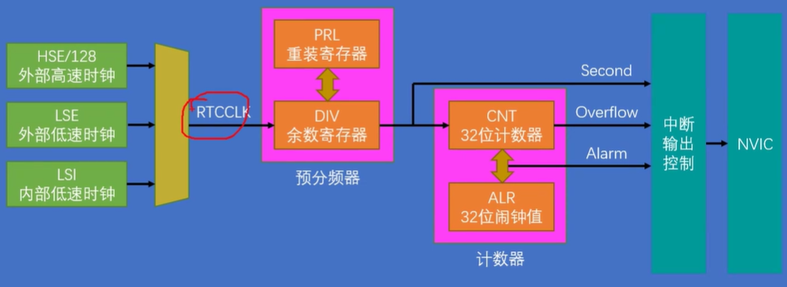

## STM32F103系统框图：

M3就是CPU，负责运算

-   **Flash**：Hex下载后是存在此处，用来记录指令和常量，掉电不丢失，内核**通过ICode**读，
-   **SRAM**：掉电丢失，是运行内存，处理堆栈和变量。内核通过**DCode**读写。
-   **RCC**：用来管理诸多外设的时钟是否开启
-   **SDIO**：外置内存卡接口
-   **DMA**：外设的DMA请求给DMA信号，DMA通过DAM通道操作总线矩阵和各外设即存储单元沟通，最后将结果通过system线返回给CPU
-   **AHB/APB**：外CPU和外设提供通信以及时钟同步，APB2时钟最大72MHz，APB1最大36MHz
-   **总线矩阵**：会对CPU、DMA与外设的沟通权进行仲裁，和沟通各个外设与CPU。
-   **system**：CPU和片上外设沟通的桥梁

以上参考：[大话STM32F103系统架构 - KenSporger - 博客园 (cnblogs.com)](https://www.cnblogs.com/kensporger/p/12252612.html)

## 时钟系统

-   STM32时钟树：时钟来源有四个，内部的**HSI**（8MHz）、**LSI**（40KHz），外部晶振提供的的包括**HSE**（4-16MHz）、**LSE**(32.768KHz)
-   LSI：主要供给RTC，同时RTC也能接LSE保证掉电后继续计时。
-   PLL：来源有三个HSI/2、HSE、HSE/2，经过锁相环电路倍频，最高可达72MHz。
-   SYSCLK：系统时钟，来源是PLLCLK、HSI、HSE。最大支持72MHz。供 STM32 中绝大部分部件工作的时钟源，包括AHB总线、Cortex系统时钟、APB1外设、APB2外设、定时器、ADC、SDIO、DMA。

STM32 时钟系统的配置除了初始化的时候在 system_stm32f10x.c 中的 SystemInit()函数中外，其他的配置主要在 stm32f10x_rcc.c 文件中。

## 串口下载程序原理

程序运行在Flash中，也就是往0x0800 0000中写什么程序，开机后就运行什么程序。如何实现更新呢，会有一个小的辅助程序bootloader存储在0x1FFF F000中，在bootloader模式下，就会启动这个辅助程序，他负责从串口读数据，然后写入到Flash中，再次上电，退出bootloader模式，就会运行新的程序了。

## RTC时钟

### unix时间戳：

### BKP：备份寄存器

bkp数据需要vbat引脚接电池

### RTC：实时时钟

-   可以独立计时，为系统提供时钟和日历功能。
-   RTC也接VBAT
-   32为可编程计数器：秒时间戳
-   20位的可编程与分频器，配置不同频率的输入时钟，将其分频为1hz，保证1s计数器加1
-   可选择三种RTC时钟源：
-   -   HSE/128  8MHz/128
    -   **LES 32.768KHz**
    -   LSI  40KHz

