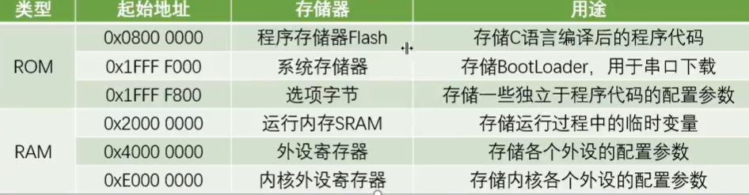
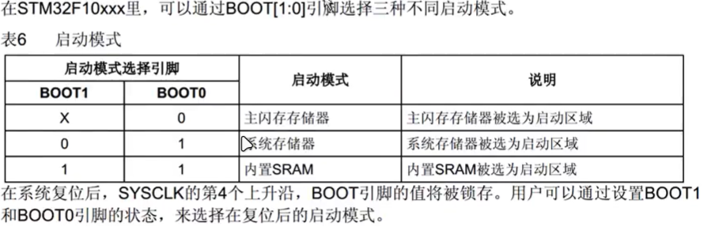

串口下载程序原理

程序运行在Flash中，也就是往0x0800 0000中写什么程序，开机后就运行什么程序。如何实现更新呢，会有一个小的辅助程序bootloader存储在0x1FFF F000中，在bootloader模式下，就会启动这个辅助程序，他负责从串口读数据，然后写入到Flash中，再次上电，退出bootloader模式，就会运行新的程序了。

## 6-3、定时器输出比较

OC（output compare）输出比较

输出比较可以通过比较CNT与CCR（输出比较/输入捕获）寄存器值的关系，来对输出电平置0、1、翻转，用于输出一定频率和占空比的PWM波形

每个高级和通用定时器有四个输出比较通道。

7.1 ADC
