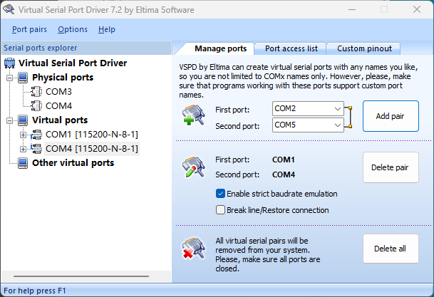
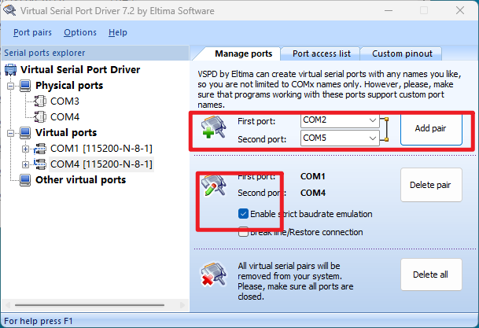
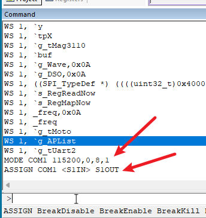
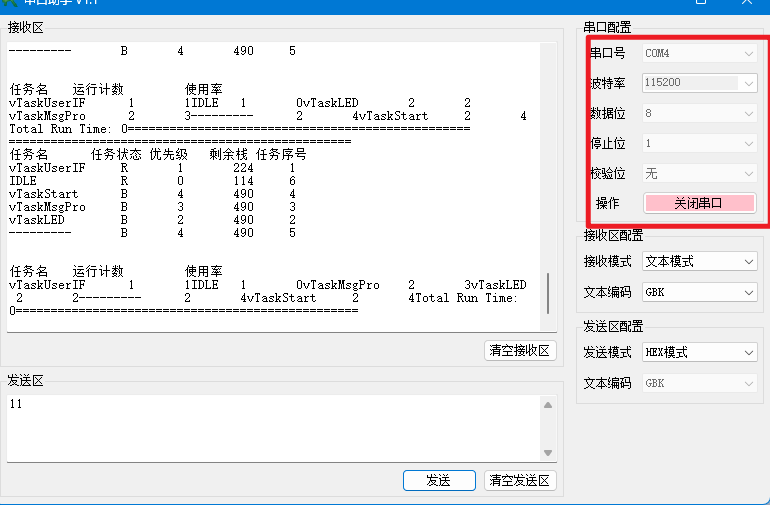
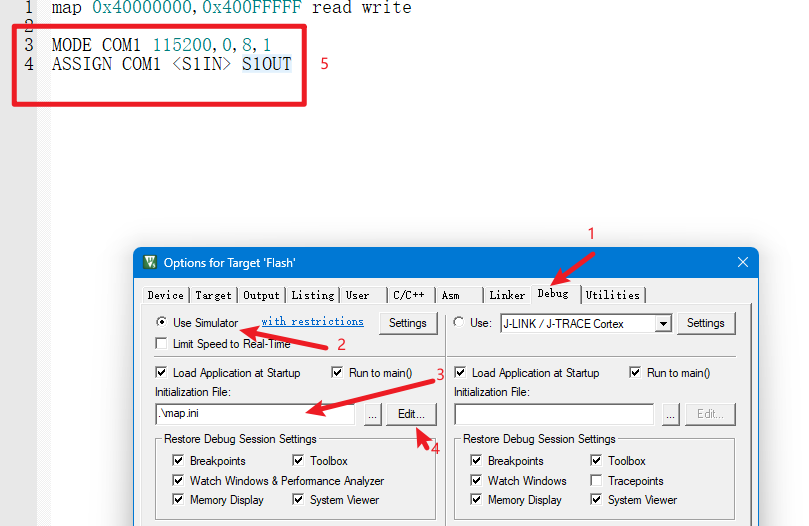

在使用keil仿真调试中，经常使用串口打印数据，但如果想给单片机发送串口数据，就不知道该怎么做了，针对这个问题，我使用了如下操作来完成仿真调试时串口助手的使用。

1、单片机具有串口收发功能（略）

2、使用VSPD工具：[virtual serial port driver-虚拟串口](http://www.pc0359.cn/downinfo/43905.html)



3、明确单片机中，自己使用的是哪个串口，以串口1为例，假设想让单片机COM1和电脑COM4相连，



选择1和4（我已选择过了），ENABLE下面的选项。

4、Keil进入调试模式，在窗口输入命令：



```c
MODE COMx 波特率,校验位,长度,停止位
ASSIGN COMx <SnIN> SnOUT         n:单片机中的第几个串口
```

5、打开串口助手，接收发送数据



6、改进

这样每次进DEBUG都需要输入命令，可以这样做

